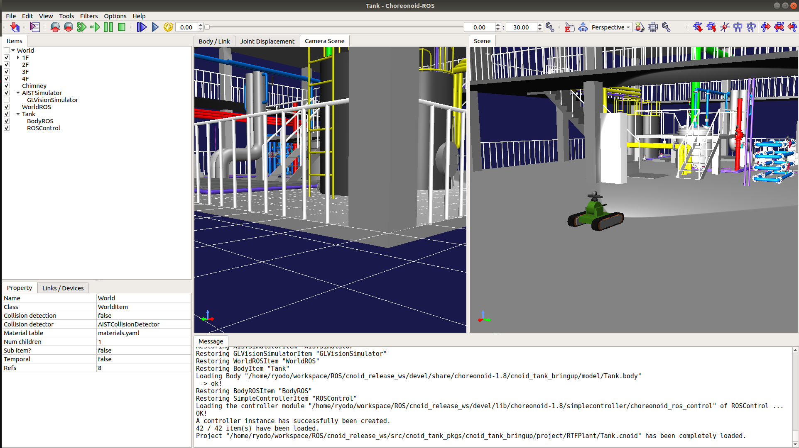
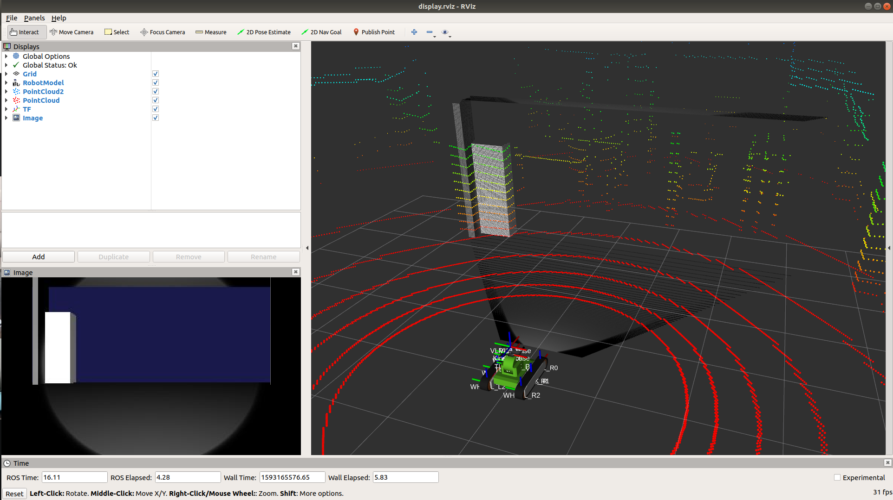
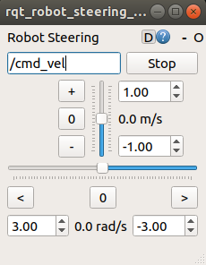

実行 
=======================================================

ここでは，予め用意している `launchファイル <http://wiki.ros.org/roslaunch>`_ を使って"Tank"モデルをテストフィールド上にSpawnさせ，ROSのPub/Sub機能を用いてセンサ情報のSubscribeと，動作を行います．

.. contents::
   :local:

.. _ros_cnoid_tank_ex1:

起動
----------------------

.. highlight:: sh

前節までの説明が完了したら，まずは下記コマンドでワークスペースへのパスを通してください．::

  cd <catkin_ws>
  source devel/setup.bash

完了したら，いよいよlaunchファイルで起動を行いましょう．（2ステップです）
まずは下記コマンドで Choreonoid と ros_control を起動します．::

  roslaunch cnoid_tank_bringup rtf_plant.launch

成功すると，下図のように Choreonoid が起動します．

最後に，下図の再生ボタンを押下し，シミュレートを実行してください．

.. image:: images/rtf_plant2.png
   :align: center
            
以上で起動が完了しました！！
ROSの扱いに慣れている方ならば，後はPub/Subを行ってロボットを動かして見てください．
本チュートリアルでは，ROS初学者の方のために， `rviz <http://wiki.ros.org/rviz>`_ を使ったセンサ情報等の表示と， `rqt_robot_steering <http://wiki.ros.org/rqt_robot_steering>`_ を使ったロボットのテレオペレーションを行う方法を紹介します．

簡単なROSとのインテグレーション
---------------------------------

先程までの続きで，Choreonoid を起動している端末（ターミナル）とは別の端末を開き，下記コマンドで `rviz <http://wiki.ros.org/rviz>`_ を起動します．なお，このlaunchファイルは，予め設定している表示設定ファイルを読み込んで `rviz <http://wiki.ros.org/rviz>`_ を起動しているだけです．::

  cd <catkin_ws>
  source devel/setup.bash
  roslaunch cnoid_tank_bringup display.launch

成功すると，下図のような画面（RViz）が表示されます．

続いて， `rqt_robot_steering <http://wiki.ros.org/rqt_robot_steering>`_ を使って，シミュレータ内の"Tank"ロボットをROSのトピックを介して動かしてみましょう．
まずは下記コマンドで， `rqt_robot_steering <http://wiki.ros.org/rqt_robot_steering>`_ をインストールしてください（すでに完了している方は不要です．） ::

  sudo apt install ros-melodic-rqt-robot-steering

完了したら，下記コマンドで起動してください．::

  rosrun rqt_robot_steering rqt_robot_steering 
  
成功すると，下図のようなウィンドウが表示されます．

最後に，下図の場所に Topic 名を記入します．
ここでは，"/Tank/base_controller/cmd_vel" と入力してください（コピー＆ペーストができます）．

.. image:: images/rqt2.png
   :align: center

以上ですべての起動が完了です！！
あとはウィンドウのスクロールバーを動かして"Tank"モデルを動かして遊んでみましょう！！

更に...？
-------------------------

これ以降は，ROSの豊富なエコシステムを利用していろいろな機能を試してみましょう．
例えばSLAMを行ってみると興味深いかもしれません...！
 
.. image:: images/slam.png
   :align: center
