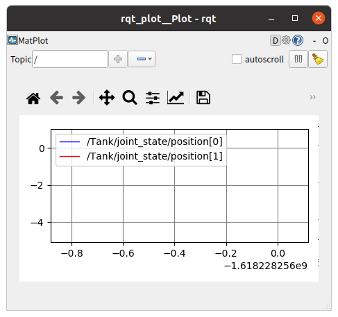
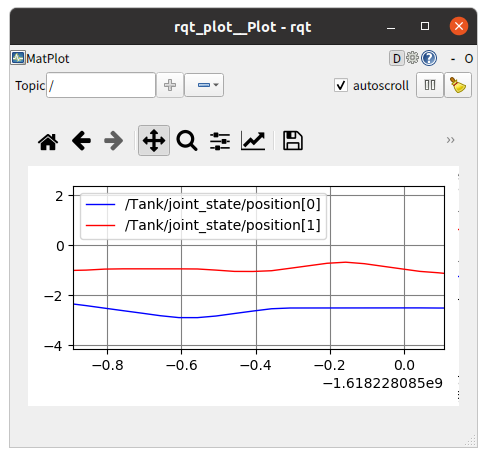

ステップ2: JointStateトピックのPublishによるTankの状態出力
==========================================================

ステップ2では、ROSを用いた通信、具体的にはROSトピックのPublishによって、ロボットの状態を外部に出力する方法を説明します。

.. contents::
   :local:

概要
----

ステップ1では外部でPublishされているROSトピックをコントローラでSubscribeして受信する方法を説明しました。ステップ2ではこれとは逆の処理として、コントローラ側からROSトピックをPublishして送信する方法を学びます。

具体的には、Tankの各関節の状態をJointStateトピックとしてPublishできるようにします。Publishされたロボットの関節状態は他のROSノードからSubscribeして利用することが可能となります。

状態出力用コントローラ
----------------------

.. highlight:: c++
   :linenothreshold: 7

Choreonoidではロボットの状態出力も基本的にはコントローラの中に実装します。そこで本ステップでは関節の状態を出力するための "JointStateOutputController" というコントローラを新たに作成することにします。まずはそのソースコードを最初に示します。このサンプルを題材として、ロボットの状態をROSトピックとしてPublishする方法を解説します。 ::

 #include <cnoid/SimpleController>
 #include <ros/node_handle.h>
 #include <sensor_msgs/JointState.h>
 
 using namespace std;
 using namespace cnoid;
 
 class JointStateOutputController : public SimpleController
 {
     BodyPtr ioBody;
     ros::NodeHandle node;
     ros::Publisher jointStatePublisher;
     sensor_msgs::JointState jointState;
     double time;
     double timeStep;
     double cycleTime;
     double timeCounter;
 
 public:
     virtual bool configure(SimpleControllerConfig* config) override
     {
         node.reset(new ros::NodeHandle(config->body()->name()));
         jointStatePublisher = node->advertise<sensor_msgs::JointState>("joint_state", 1);
         return true;
     }
         
     virtual bool initialize(SimpleControllerIO* io) override
     {
         ioBody = io->body();
 
         int n = ioBody->numJoints();
         jointState.name.resize(n);
         jointState.position.resize(n);
         jointState.velocity.resize(n);
         jointState.effort.resize(n);
 
         for(int i=0; i < n; ++i) {
             auto joint = ioBody->joint(i);
             io->enableInput(joint, JointDisplacement | JointVelocity | JointEffort);
             jointState.name[i] = joint->name();
         }
 
         time = 0.0;
         timeStep = io->timeStep();
         double frequency = 50.0;
         cycleTime = 1.0 / frequency;
         timeCounter = 0.0;
 
         return true;
     }

     virtual bool control() override
     {
         time += timeStep;
         timeCounter += timeStep;
 
         if(timeCounter >= cycleTime) {
             
             jointState.header.stamp.fromSec(time);
 
             for(int i=0; i < ioBody->numJoints(); ++i) {
                 auto joint = ioBody->joint(i);
                 jointState.position[i] = joint->q();
                 jointState.velocity[i] = joint->dq();
                 jointState.effort[i] = joint->u();
             }
             
             jointStatePublisher.publish(jointState);
 
             timeCounter -= cycleTime;
         }
 
         return true;
     }
 };
 
 CNOID_IMPLEMENT_SIMPLE_CONTROLLER_FACTORY(JointStateOutputController)

状態出力用コントローラの基本構造
--------------------------------

コントローラはステップ1と同様にSimpleControllerとして実装します。

コントローラの基本的な構造としては、まず ::

 #include <cnoid/SimpleController>

で基底となるSimpleControllerクラスの定義を取り込み、 ::

 class JointStateOutputController : public SimpleController

といったかたちで対象となるコントローラをSimpleControllerを継承したクラスとして定義します。

そしてSimpleControllerで定義されているvirtual関数のうち、まず

* **virtual bool configure(SimpleControllerConfig* config)**

をオーバーライドして、コントローラ導入時の初期化処理として、ROSのPublisherを生成する処理を記述します。次に

* **virtual bool initialize(SimpleControllerIO* io)**

をオーバライドして、シミュレーション開始時の初期化処理を行います。そして

* **virtual bool control()**

をオーバーライドし、Publisherを用いた状態出力の処理を記述します。

この構造はステップ1で作成したJoyInputControllerとほぼ同じですが、control関数の使い方が若干異なると言えるかもしれません。control関数は通常は制御の処理を記述するもので、JoyInputControllerではTankの制御を記述していました。しかしこの関数の本質はコントローラの制御周期で繰り返し何らかの処理を行うことにあり、周期処理の内容は必ずしもロボットの制御である必要はありません。そこで今回のようにロボットの状態を出力する処理にもこの関数を利用できるというわけです。

ノードハンドルの生成
--------------------

まずROS通信を行うためにはROSノードが必要となります。このためまず ::

 #include <ros/node_handle.h>

で必要な定義を取り込み、ノードのハンドルに対応する変数を ::

 ros::NodeHandle node;

として定義しています。そしてconfigure関数にて ::

 node.reset(new ros::NodeHandle(config->body()->name()));

としてノードハンドルを生成しています。

この処理自体はステップ1でも行ったものですが、ここではノードハンドルにネームスペースとして対象モデルの名前を与えています。ネームスペースは必ずしも必要ありませんが、ここではトピックをより区別しやすくするために付与しています。モデル名をネームスペースに含めることで、トピックがそのモデルの状態に関わるものであることを示唆できるからです。

ここでは ::

 config->body()->name()

によって対象モデルの名前を取得しています。configオブジェクトについては :ref:`simulation-implement-controller-simple-controller-class-supplement` を参照してください。

今回のサンプルではモデル名は "Tank" となりますので、以下で生成されるトピック名には全て "/Tank" のプレフィックスが付与されることになります。

Publisherの生成
---------------

ROSにおいてトピックは対応するPublisherによって出力される設計となっており、roscppにおいてもこれに対応するPublisherクラスが定義されています。このPublisherに対応するメンバが ::

 ros::Publisher jointStatePublisher;

です。

また、Publishするためには対応するトピックのメッセージ（データ）を用意する必要があります。このためにはまずメッセージの型を決めなければなりません。本サンプルではROSの標準パッケージで定義されている **"sensor_msgs::JointState"** 型を使用することにします。

この内容を確認するため ::

 rosmsg show sensor_msgs/JointState

を実行してみましょう。すると以下のように表示されるかと思います。

.. code-block:: none

 std_msgs/Header header
   uint32 seq
   time stamp
   string frame_id
 string[] name
 float64[] position
 float64[] velocity
 float64[] effort

ここで "hader" の部分は各ROSメッセージに共通のヘッダの部分で、ステップ1で使用したJoyトピックに含まれていたものと同様です。その後の部分がJointState型の本体と言える部分で、name、position、velocity、effotの各メンバが定義されています。それぞれ関節の名前、関節変位、関節速度、関節エフォート（トルク又は力）に対応します。これらは全て配列となっており、ロボットが保有する関節数分の要素を格納することになります。このメッセージ型によってロボットの関節の状態を出力することができますね。

C++のコードからこのメッセージ型を利用するためには、メッセージ型に対応するクラスを変数として定義します。既にパッケージとしてインストールされているメッセージ型であれば、C++で使用するためのヘッダファイルもインストールされているはずです。その場合、メッセージ型の名称にそのまま対応するC++クラスが存在します。

ここではJointState型を利用するために、まず ::

 #include <sensor_msgs/JointState.h>

によって対応するヘッダをインストールしています。ヘッダのパスはROSに登録されているメッセージの型名にそのまま対応していますね。

そしてこの型に対応する変数を ::

 sensor_msgs::JointState jointState;

として定義しています。こちらもネームスペースを使うことでメッセージの型名にほぼそのまま対応していますね。

.. note:: 本サンプルでは既存のメッセージ型を使用していますが、独自に定義したメッセージ型を用いることも可能です。その方法については別途roscppのマニュアルをご参照ください。

ではこのメッセージ型のデータを出力するためのPublisherを生成しましょう。これはconfigure関数内の以下のコードが対応します。 ::

 jointStatePublisher = node->advertise<sensor_msgs::JointState>("joint_state", 1);

このようにノードハンドルのadvertise関数を用いてPublisherを生成することができます。この関数はメッセージ型を引数とするテンプレート関数となっていて、このようにJointState型を指定することでJointStateメッセージを出力するPublisherを生成できます。

関数の最初の引数はトピック名です。実際のトピック名は、ノードのネームスペースとして設定した "Tank" と結合されて、 "/Tank/joint_state" となります。

2番目の引数は出力に使用するキューのサイズを指定します。短い周期で多数のメッセージを出力し、なおかつメッセージの取りこぼしがないことが望ましい場合には、キューのサイズを大きめにします。そのような必要がなく、メッセージの受け取り側では各時点での最新のメッセージだけ取得できればよいのであれば、キューのサイズは1を指定するのが適切かと思います。今回は特に取りこぼしを防ぐことは想定しないサンプルになりますので、キューサイズに1を指定しています。

これでJointState型のメッセージを出力するPublisherを生成することができました。

関節状態のPublish
-----------------

関節の状態を出力する処理の流れは以下のようになります。

1. ロボットの関節の状態を取得する
2. JointState型の変数に状態をコピーする
3. Publisherを用いてJointState型のメッセージを出力する

これらは全てシンプルコントローラのcontrol関数内で行います。control関数を用いることで、ロボットが稼働している間の関節の状態を周期的に繰り返し出力することが可能となります。

ただし上記の処理を行うための準備も必要です。これはinitialize関数内で記述しています。

まず ::

 int n = ioBody->numJoints();
 jointState.name.resize(n);
 jointState.position.resize(n);
 jointState.velocity.resize(n);
 jointState.effort.resize(n);

で、ロボットの関節数を取得し、JointStateの各メンバの配列について関節数分のサイズを確保しています。制御の最中でロボットの関節数が変わることは無いので、この処理は初期化時に一度だけやるようにしています。そのような処理はinitialize関数内に記述します。なお、本サンプルで使用するTankモデルの関節数は砲塔ヨー軸・砲身ピッチ軸の2軸となります。

次にロボットの状態をシンプルコントローラに入力するための設定を行います。これはやはりinitialize関数内に記述された以下のコードで処理されています。 ::

 for(int i=0; i < n; ++i) {
     auto joint = ioBody->joint(i);
     io->enableInput(joint, JointDisplacement | JointVelocity | JointEffort);
     jointState.name[i] = joint->name();
  }

ここではシンプルコントローラの :ref:`simulation-implement-controller-simple-controller-io` のenableInput関数を用いて、ロボットからシンプルコントローラに入力する状態値を指定しています。JointDisplacement、JointVelocity、JointEffortを指定することで、砲塔と砲身の２軸に対して関節変位と関節速度および関節トルクをそれぞれ入力するようにしています。また、あわせて関節名を取得し、JointStateメッセージのnameメンバにコピーしています。これによりトピックの受信側で関節名も取得できることになります。

入出力設定の詳細は :ref:`simulation-implement-controller-io-by-body-object` を参照してください。

初期化の最後に ::

 time = 0.0;
 timeStep = io->timeStep();
 double frequency = 50.0;
 cycleTime = 1.0 / frequency;
 timeCounter = 0.0;

として時間関係の変数の初期化をしています。ここで設定した値はcontrol関数内で参照します。

frequencyに設定している値はPublishのフレームレートに対応するもので、Publishの頻度を決めるものです。この値を大きくするとより時間分解能の高い状態出力になりますが、その分通信のコストは増えてしまうので、ネットワーク環境やシステム全体の通信量などを踏まえて適切に調整する必要があります。

以上で準備は終わりました。あとは上記1〜3の処理をcontrol関数内に記述します。

まずcontrol関数は状態出力の周期を調整するために以下の構造で記述されています。 ::

 time += timeStep;
 timeCounter += timeStep;
 
 if(timeCounter >= cycleTime) {
            
     // JointStateメッセージの作成とPublish
     ...

     timeCounter -= cycleTime;
 }

ここでtimeにはシミュレーション開始時から数えた時刻が秒で入ります。また、状態出力の周期を調整するために、timeCounterには最後の出力からの経過時間を入れています。

そして ::

 if(timeCounter >= cycleTime) {

によって、timeCounterが周期に対応するcycleTimeに達した場合にのみ、状態の出力を行うようにしています。一般的にcontrol関数はロボットの制御周期で実行されますが、それは状態出力の周期としては短すぎる場合が多いです。そこでこのサンプルでは別途状態出力用の周期を設定することで、適切な周期での状態出力がされるようにしています。このような出力周期の調整は各トピックごとにその種類や用途も踏まえて行う必要がありますので、この点留意するようにしてください。

timeCounterが設定周期に達して状態出力を行った際には、 ::

 timeCounter -= cycleTime;

でtimeCounterをリセットするようにしています。

このように周期が調整された上で、実際の状態出力はこのif分の中のコードで行っています。

まず ::

 jointState.header.stamp.fromSec(time);

によって、JointStateメッセージのヘッダのstampに現在時刻を設定しています。

そして ::

 for(int i=0; i < ioBody->numJoints(); ++i) {
     auto joint = ioBody->joint(i);
     jointState.position[i] = joint->q();
     jointState.velocity[i] = joint->dq();
     jointState.effort[i] = joint->u();
 }

によって、砲塔、砲身軸の関節角度、関節角速度、および関節トルクをJointState型の対応するメンバにコピーしています。

これで現在の関節状態をJointState変数に格納することができました。あとはこれをPublishするだけです。この処理はPublisherオブジェクトのpublish関数にメッセージを与えて、 ::
            
 jointStatePublisher.publish(jointState);

とすればOKです。

これで設定した周期ごとにJointState型のメッセージでトピック /Tank/joint_state がPublishされるようになります。

状態出力用コントローラの導入
----------------------------

上記のソースコードに対応するコントローラをビルドしてシミュレーションプロジェクトに導入しましょう。やりかたはステップ1で導入したJoyInputControllerと同じです。

まず上記ソースコードをsrcディレクトリ内に "JointStateOutputController.cpp" というファイル名で作成しましょう。そして同じsrcディレクトリ内のCMakeLists.txtにこのコントローラをビルドするための以下の記述を追加します。

.. code-block:: cmake

 choreonoid_add_simple_controller(JointStateOutputController JointStateOutputController.cpp)
 target_link_libraries(JointStateOutputController ${roscpp_LIBRARIES})

この作業をした上で再度 catkin build を行うと、ソースコードやCMakeLists.txtの記述に誤りがなければ、JointStateOutputControllerがビルドされて利用可能となるはずです。ビルドにおいてエラーが出た場合は適宜修正するようにしてください。

ビルドに成功したら、ステップ1の :ref:`ros_tank_tutorial_step1_introduce_controller` と同様に、JointStateOutputControllerをシミュレーションプロジェクトに追加します。

シンプルコントローラは複数組み合わせて利用できるようになっているので、アイテムツリーを以下のように構成すればOKです。

.. code-block:: none

 + World
   + Tank
     + JoyInputController
     + JointStateOutputController
   + Labo1
   + AISTSimulator

JointStateOutputControllerを追加するため、SimpleControllerアイテムをTankアイテムの小アイテムとして生成し、その「コントローラモジュール」プロパティのダイアログで "JointStateOutputController.so" を選択してください。

この状態にしたプロジェクトを保存しましょう。本チュートリアルではステップごとにプロジェクトファイルを分けて保存することにします。そこで今回のプロジェクトは "step2.cnoid" というファイル名で保存しましょう。また、ステップ2用のLaunchファイルも作成しましょう。とりあえずステップ1用に作成したLaunchファイルである"step1.launch" をコピーして "step2.launch" を作成します。そして "step1.cnoid" の部分を "step2.cnoid" に修正します。すると "step2.launch" は以下のようになります。

.. code-block:: xml

 <launch>
   <node pkg="choreonoid_joy" name="choreonoid_joy" type="node" />
   <node pkg="choreonoid_ros" name="choreonoid" type="choreonoid"
         args="$(find choreonoid_ros_tank_tutorial)/project/step2.cnoid --start-simulation" />
   <node pkg="rqt_graph" name="rqt_graph" type="rqt_graph" />
 </launch>

ここまで作業を進めると、本チュートリアル用パッケージは以下のファイル構成になるかと思います。

.. code-block:: none

 + choreonoid_ros_tank_tutorial
   + launch
     + step1.launch
     + step2.launch
   + project
     + step1.cnoid
     + step2.cnoid
   + src
     + JoyInputController.cpp
     + JointStateOutputController.cpp

出力トピックの確認
------------------

.. highlight:: sh

シミュレーションプロジェクトを実行し、関節状態のトピックが出力されているか確認しましょう。

まず以下のコマンドでステップ2のプロジェクトを起動します。 ::

 roslaunch choreonoid_ros_tank_tutorial step2.launch

するとステップ1と同様にゲームパッドでTankロボットを操作できるかと思います。

ここでコマンド入力用の端末を用意し、まずは端末からトピックの確認をしてみましょう。

まず以下のコマンドを実行して利用可能なトピックの一覧を表示します。 ::

 rostopic list

すると以下のように表示されるかと思います。

.. code-block:: none

 /Tank/joint_state
 /joy
 /rosout
 /rosout_agg
 /statistics

ここで "/Tank/joint_state" が今回実装したトピックに対応しています。もしこのトピックが表示されていなければ、ソースコードやプロジェクトのどこかに誤りがありますので、確認してください。

次に以下のコマンドでこのトピックの情報を確認しましょう。 ::

 rostopic info /Tank/joint_state

すると以下のように表示されるかと思います。 

.. code-block:: none

 Type: sensor_msgs/JointState
 
 Publishers: 
  * /choreonoid (http://host:38755/)
 
 Subscribers: None

これにより、

* メッセージ型がsensor_msgs/JointStateであること
* このトピックのPublisherとなるノードが表示されたホストにある/choreonoidというノードであること
* Subscriberは無いこと

が分かります。Subscriberについては、まだ何も接続していないので、このような結果になります。

Publishされているメッセージの内容も確認してみましょう。以下のコマンドを入力します。 ::

 rostopic echo /Tank/joint_state

すると以下のようなテキストが出力され続けるかと思います。 ::

 header: 
   seq: 31
   stamp: 
     secs: 1
     nsecs: 600000000
   frame_id: ''
 name: 
   - TURRET_Y
   - TURRET_P
 position: [1.6122377450560194e-09, -0.00979137291587475]
 velocity: [-2.827205716540265e-10, -6.034345222794471e-05]
 effort: [-3.091940828686953e-07, 1.9612950742218773]
 ---

この出力を続けながら、ゲームパッドで砲身を動かしてみてください。するとposition、velocity、effortの値が変化するかと思います。それぞれ単位は [rad]、[rad/sec」、[N・m] になります。

ちなみにrostopic echoを止めずに別の端末で再度 "rostopic info /Tank/joint_state" を実行すると、今度は Subscribers: のところが None ではなくなっているはずです。このSubscriberは "rostopic echo" に対応するものです。

これで関節の状態が無事ROSトピックとして出力できていることが確認できました。

関節角度のグラフ表示
--------------------

関節の状態がROSトピックとして出力できるようになったことで、ROSの様々なノード（ツール）と連携してこの情報を活用することが可能となります。ここではそのごく簡単な例として、rqt_plotというツールで関節角度のグラフ表示をしてみましょう。

先程のシミュレーションが実行されている状態で、端末から以下のコマンドを入力します。 ::

 rosrun rqt_plot rqt_plot /Tank/joint_state/position[0] /Tank/joint_state/position[1]

すると以下のようなウィンドウが表示されます。

ここで右上の "autoscroll" のチェックを入れて、ゲームパッドで砲身を動かしてみてください。するとその関節角度の変化がグラフとして描画されるかと思います。

上の図では青線がヨー軸、赤軸がピッチ軸に対応しています。

最後にこのrqt_plotの表示もLaunchファイルに含めておきましょう。step2.launchにこの項目を追加して以下のようにします。

.. code-block:: xml

 <launch>
   <node pkg="choreonoid_joy" name="choreonoid_joy" type="node" />
   <node pkg="choreonoid_ros" name="choreonoid" type="choreonoid"
         args="$(find choreonoid_ros_tank_tutorial)/project/step2.cnoid --start-simulation" />
   <node pkg="rqt_graph" name="rqt_graph" type="rqt_graph" />
   <node pkg="rqt_plot" name="rqt_plot" type="rqt_plot"
         args="/Tank/joint_state/position[0] /Tank/joint_state/position[1]" />
 </launch>

これでlaunchファイルを起動すればrqt_graphによるグラフ表示も行われるようになります。

以上でステップ2は終了です。
