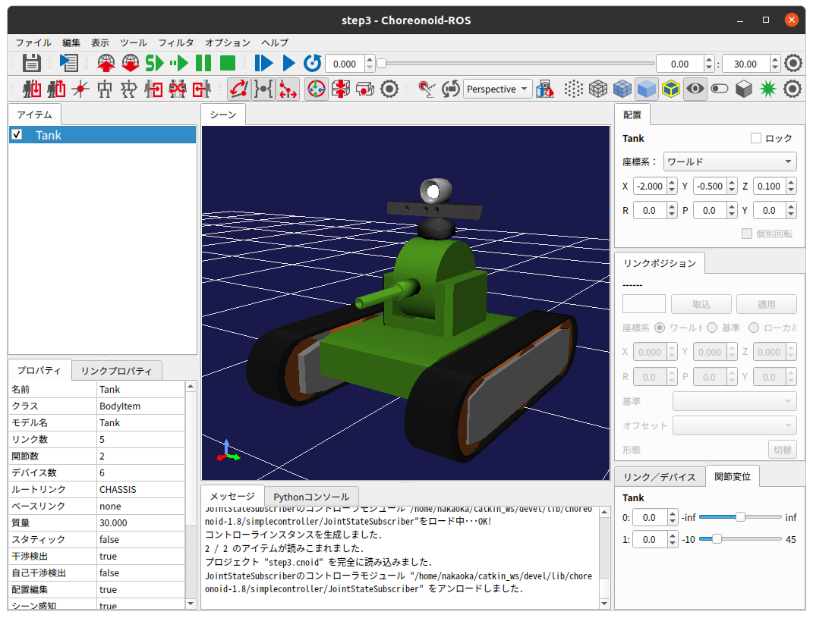
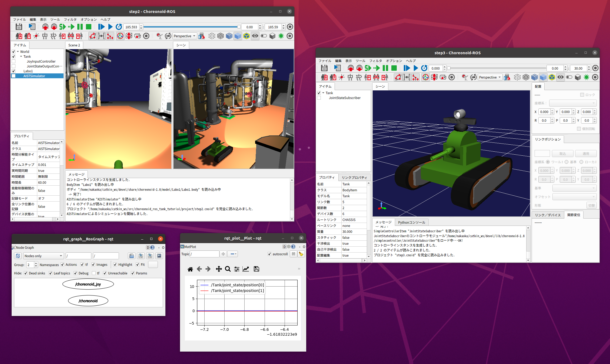

ステップ3: JointStateトピックのSubscribeによるTankの状態表示
============================================================

ステップ3では関節状態のROSトピックをSubscribeして利用する側のプログラムを作成します。

.. contents::
   :local:

概要
----

ステップ2ではTankロボットの関節の状態をJointState型のROSトピックとしてPublishし外部に出力する機能を実装しました。ステップ3ではこのトピックをSubscribeして利用する側のプログラムを作成します。具体的には、シミュレーションとは別にもうひとつChoreonoidを起動し、そこで現在の関節の状態を可視化するビュアー的な機能を実現します。このような機能はロボットのモニタリングや遠隔操作にも応用できるものです。

.. 本チュートリアルの最後にそのような応用につながるリモート通信の方法についても紹介します。

状態可視化用Choreonoidプロジェクトの作成
----------------------------------------

本ステップではロボットの状態の可視化用としてもうひとつのChoreonoidを起動して使用します。まずはこの可視化に使用するChoreonoidの
準備として、プロジェクトの雛形を作りましょう。

と言ってもこれは非常に簡単で、シミュレーションに使用しているのと同じTankモデルをひとつ読み込んだプロジェクトを作成すればOKです。シミュレーションを行うわけではないので、シミュレータアイテムは当然必要ないですし、今回はTankの関節の状態を表示することが目的なので、環境モデルも必要ありません。そしてそれらを取りまとめるためのワールドアイテムも必要ありません。

従って雛形となるプロジェクトのアイテムツリーはシンプルに以下のようになります。

.. code-block:: none

 - Tank

プロジェクト無しでChoreonoidノードを起動してBodyアイテムの読み込みを行ってもよいですし、ステップ2までのプロジェクトファイルをコピーして、そこからTankモデル以外のアイテムを削除して作成してもよいです。このプロジェクトの画面は以下のようになります。

ここでTankモデルはこのように少し大きめに表示されるようズームを調整しておくとよいでしょう。

このプロジェクトを "step3.cnoid" というファイル名で project ディレクトリに保存しておくことにします。

状態可視化用コントローラの導入
------------------------------

プロジェクトの雛形を作成しましたが、もちろんこれだけではTankロボットの状態を可視化することはできません。これを行うためには、JointStateトピックをSubscribeし、それを基に可視化用のTankモデルの状態を更新する処理をどこかに導入する必要があります。

この処理についてはいろいろな実装方法が考えられますが、本チュートリアルではシミュレーションでも使用しているシンプルコントローラをこの処理にも用いることとします。シンプルコントローラは柔軟な設計となっており、必ずしもシミュレーション中のロボットの制御だけではなく、Bodyアイテムとして読み込まれて表示されているだけのモデルについても処理対象とすることが可能となっています。

ここではまず状態可視化用コントローラのソースコードを提示しますので、それをビルドしてプロジェクトに導入し、関節状態の可視化をまず動かしてみましょう。それによってこのコントローラの機能をまず把握してから、実装内容の解説を行うことで、実装内容をより理解しやすくなるのではないかと思います。

ソースコード
~~~~~~~~~~~~

.. highlight:: c++
   :linenothreshold: 7

状態可視化用コントローラのソースコードは以下になります。 ::

 #include <cnoid/SimpleController>
 #include <cnoid/BodyItem>
 #include <cnoid/LazyCaller>
 #include <ros/node_handle.h>
 #include <sensor_msgs/JointState.h>
 
 using namespace std;
 using namespace cnoid;
 
 class RttJointStateSubscriber : public SimpleController
 {
     std::unique_ptr<ros::NodeHandle> node;
     ros::Subscriber subscriber;
     BodyItemPtr bodyItem;
 
 public:
     virtual bool configure(SimpleControllerConfig* config) override
     {
         bodyItem = static_cast<BodyItem*>(config->bodyItem());
         node.reset(new ros::NodeHandle(bodyItem->name()));
         subscriber = node->subscribe(
            string("/") + bodyItem->name() + "/joint_state",
            1,
            &RttJointStateSubscriber::jointStateCallback, this);
         return true;
     }
 
     void jointStateCallback(const sensor_msgs::JointState& state)
     {
         callLater([this, state](){ updateJointState(state); });
     }
 
     void updateJointState(const sensor_msgs::JointState& state)
     {
         auto body = bodyItem->body();
         auto& names = state.name;
         auto& positions = state.position;
         int size = std::min(names.size(), positions.size());
         int n = std::min(body->numJoints(), size);
         for(int i=0; i < n; ++i){
             auto joint = body->joint(i);
             if(joint->jointName() == names[i]){
                 joint->q() = positions[i];
             }
         }
         bodyItem->notifyKinematicStateChange(true);
     }
 
     virtual void unconfigure() override
     {
         bodyItem.reset();
         node.reset();
         subscriber = ros::Subscriber();
     }
 };
 
 CNOID_IMPLEMENT_SIMPLE_CONTROLLER_FACTORY(RttJointStateSubscriber)

.. _ros_tank_tutorial_step3_build:

コントローラのビルド
~~~~~~~~~~~~~~~~~~~~

このソースコードを **"RttJointStateSubscriber.cpp**" というファイル名でsrcディレクトリに作成してください。そしてsrcディレクトリのCMakeLists.txtに以下のビルド処理を記述します。

.. code-block:: cmake

 choreonoid_add_simple_controller(RttJointStateSubscriber RttJointStateSubscriber.cpp)
 target_link_libraries(RttJointStateSubscriber ${roscpp_LIBRARIES} Choreonoid::CnoidBodyPlugin)

ステップ2までとは異なる点として、target_link_libraries に **Choreonoid::CnoidBodyPlugin** を追加しています。これはCMakeの「インポートライブラリ」と呼ばれるもので、あたかもこのライブラリが同じCMakeプロジェクト内でビルドされているかのように使うことができるものです。ここではChoreonoidのBodyプラグインに対応するCnoidBodyPluginライブラリを指定していて、これによって該当ライブラリへのリンクや、その他ビルドに必要な（インクルードディレクトリやコンパイルオプション等の）各種設定もなされることになります。このようなChoreonoidが提供するライブラリのインポートライブラリは、find_packageでchoreonoidを指定すると使用できるようになります。それらは全て **"Choreonoid::ライブラリ名"** という形式で定義されます。

ここで指定しているBodyプラグインのライブラリによって、Bodyプラグインやその依存先のライブラリで定義されているクラスや関数を利用することが可能となります。本コントローラでは可視化を行うためにChoreonoidのGUIと関連するBodyItemクラスやcallLater関数を使用しており、この記述が必要となっています。なおcallLater関数はChoreonoidのBaseライブラリで定義されており、それを明示的に含めると

.. code-block:: cmake

 target_link_libraries(RttJointStateSubscriber ${roscpp_LIBRARIES} Choreonoid::CnoidBase Choreonoid::CnoidBodyPlugin)

という記述になりますが、CnoidBaseはCnoidBodyPluginが依存しているので、後者のみの記述で前者も取り込まれることになります。

ソースファイルの作成とCMakeLists.txtの記述が完了したらcatkin buildでビルドを行いましょう。ビルドに成功すると"RttJointStateSubscriber.so"というファイル名でシンプルコントローラのバイナリファイルが生成されます。

プロジェクトへの導入
~~~~~~~~~~~~~~~~~~~~

ビルドしたコントローラをプロジェクトに導入してプロジェクトを完成させましょう。これまでのステップと同様に、Tankの子アイテムとしてシンプルコントローラアイテムを作成し、コントローラモジュールに "RttJointStateSubscriber.so" を指定します。アイテム名も "RttJointStateSubscriber" としておくとよいでしょう。アイテムツリーは以下のようになります。

.. code-block:: none

 + Tank
   - RttJointStateSubscriber

この状態にしたプロジェクトを step3.cnoid に上書き保存してください。

シミュレーション＆可視化プロジェクトの実行
------------------------------------------

.. highlight:: sh

本サンプルでは以下の2つのChoreonoidノードを起動します。

* **シミュレーション用のChoreonoidノード** （ステップ2で作成したstep2.cnoid）
* **状態可視化（ビュアー）用のChoreonoidノード** （本ステップで作成したstep3.cnoid）

ここで注意が必要な点として、ノード名の重複を避ける必要があります。Choreonoidノードを起動すると、通常はノード名が "choreonoid" となります。しかし2つのChoreonoidノードを起動する際に、どちらも同じ名前で起動すると、ROS通信において両者を区別できなくなってしまいます。従って、どちらかのノードについてはノード名をデフォルトとは異なるものにする必要があります。

これを踏まえた上で、2つのChoreonoidノードを起動してみましょう。

まずシミュレーション用のChoreonoidノードとその関連ノードを、ステップ2用のLaunchファイルで起動します。  ::

 roslaunch choreonoid_ros_tank_tutorial step2.launch

こちらのノード名はデフォルトの "choreonoid" となります。

次に別の端末から、可視化用のChoreonoidノードをrosrunコマンドで直接起動してみましょう。 ::

 roscd choreonoid_ros_tank_tutorial/project
 rosrun choreonoid_ros choreonoid step3.cnoid __name:=choreonoid2

ここでchoreonoidノードの起動オプションとして付与している **"__name:=choreonoid2"** によって、ノード名を **"choreonoid2"** に変更しています。この書き方は、ROSノードを起動する際の標準のオプションとなります。ROSノードの起動で利用可能なオプションの詳細は `ROS WikiのNodesのページ <http://wiki.ros.org/Nodes>`_ を参照してください。

ここまで実行すると、デスクトップ画面には以下のように2つのChoreonoidのウィンドウが表示されているかと思います。

ここで別の端末から ::

 rosnode list

を実行すると、以下のように表示されます。

.. code-block:: none

 /choreonoid
 /choreonoid2
 /choreonoid_joy
 /rosout
 /rqt_graph
 /rqt_plot

ここで /choreonoid がシミュレーション用のChoreonoidノード、 /choreonoid2 が可視化用のChoreonodiノードに対応します。このように2つのChoreonoidノードが表示されていればOKです。

ではゲームパッドでTankロボットを動かしてみましょう。砲身を動かすと、その動きにあわせて可視化用Choreonoid上のTankモデルの関節角度も変化するかと思います。また、Tankロボットを動かして砲身を壁にぶつけたりすると、その分砲身の関節も反力で多少動きますが、その動きも可視化用Choreonoid上で表示されるかと思います。そのような挙動になっていれば、本プロジェクトはうまく動いています。

Launchファイルの作成
--------------------

.. highlight:: xml

先程は可視化用のChoreonoidノードをrosrunコマンドで直接起動しましたが、この操作もLaunchファイルにまとめて、本サンプルの実行で使用する全てのノードを一度に起動できるようにしましょう。以下の内容で "step3.launch" というファイルをlaunchディレクトリに作成します。 ::

 <launch>
   <node pkg="choreonoid_joy" name="choreonoid_joy" type="node" />
   <node pkg="choreonoid_ros" name="choreonoid" type="choreonoid"
         args="$(find choreonoid_ros_tank_tutorial)/project/step2.cnoid --start-simulation" />
   <node pkg="rqt_graph" name="rqt_graph" type="rqt_graph" />
   <node pkg="choreonoid_ros" name="choreonoid2" type="choreonoid"
         args="$(find choreonoid_ros_tank_tutorial)/project/step3.cnoid" />
 </launch>

最後のnodeタグの記述が可視化用Choreonoidノードに対応しています。ここで ::

 name="choreonoid2"

という記述により、このノードの名前を変更しています。このようにLaunchファイルではノード名の変更を簡潔に記述することができます。

.. highlight:: sh

このLaunchファイルを ::

 roslaunch choreonoid_ros_tank_tutorial step3.launch

として起動することで、本サンプルを実行できます。

なお、step2.launchに含まれていた関節軌道表示用のrqt_plotノードについては、本launchファイルでは含めないようにしています。

ここまで作業を進めると、本チュートリアルのパッケージは以下のファイル構成になります。

.. code-block:: none

 + choreonoid_ros_tank_tutorial
   - CMakeLists.txt
   - package.xml
   + launch
     - step1.launch
     - step2.launch
     - step3.launch
   + project
     - step1.cnoid
     - step2.cnoid
     - step3.cnoid
   + src
     - CMakeLists.txt
     - RttTankController.cpp
     - RttJointStatePublisher.cpp
     - RttJointStateSubscriber.cpp

ソースコードの解説
------------------

.. highlight:: c++

コントローラRttJointStateSubscriberのソースコードを解説します。

本コントローラでも、ステップ1のRttTankControllerと同様に、roscppのSubscriberクラスを用いてトピックのSubscribeを行っています。従ってroscppにおけるSubscriberのコーディングという点では両者は本質的に同じです。ただしRttTankControllerはTankロボットの制御を行うものでしたが、RttJointStateSubscriberでは制御は行わずにモデルの状態を直接更新するというもので、Choreonoid上での利用方法が異なっており、その点でコードにも違いが出てきます。Choreonoidではシミュレーション対象のロボットの制御だけでなく、今回のような可視化に使うこともできるという意識で読んでいただけると、以下の解説がより有益なものになるのではないかと思います。

ヘッダのインクルード
~~~~~~~~~~~~~~~~~~~~

今回のソースでは新たに2つのヘッダを導入しています。まず ::

 #include <cnoid/BodyItem>

でBodyItemクラスを使えるようにしています。BodyItemはBodyプラグインで定義されているクラスで、ロボットのモデルに対応するBodyオブジェクトをChoreonoidのGUI上で操作できるようにするためのものです。通常コントローラは特定のGUIには依存しないように実装されますが、今回はGUI上のモデルを直接更新することがそもそもの目的なので、BodyItemを使用するようにしています。

また、 ::

 #include <cnoid/LazyCaller>

によって、callLaterという関数を使えるようにしています。この関数については後ほど解説しますが、これもGUIと関連するもので、ChoreonoidのBaseモジュールで定義されているものです。

これらのクラスや関数を使用するためには、対応するライブラリを追加でリンクする必要があります。具体的にはlibCnoidBaseやlibCnoidBodyPluginといったライブラリです。 :ref:`ros_tank_tutorial_step3_build` にてリンクするライブラリを追加していたのはこのためです。

メンバ変数
~~~~~~~~~~

メンバ変数のうち ::

 std::unique_ptr<ros::NodeHandle> node;
 ros::Subscriber subscriber;

については、ステップ1のRttTankControllerで使用しているものと同じです。ROSのノードハンドルとSubscriberに対応するもので、これらのオブジェクトによってSubscribeの処理を行います。 ::

 BodyItemPtr bodyItem;

は上述のBodyItemに対応するポインタ変数です。BodyItemのポインタ型は通常 ::

 BodyItem*

となりますが、BodyItemPtrはこのスマートポインタ版で、この型を用いることで指しているオブジェクトを維持するようになります。あまり無いとは思いますが、通信をしている最中に可視化用Choreonoidノード上でTankのアイテムを削除すると、タイミングによっては削除後にモデルの更新処理が呼ばれてしまうこともあり得るため、念の為スマートポインタ版を使っています。

configure関数による初期化処理
~~~~~~~~~~~~~~~~~~~~~~~~~~~~~

今回のコントローラでは初期化処理をSimpleControllerのvirtual関数のひとつであるconfigure関数で行っています。  ::

 virtual bool configure(SimpleControllerConfig* config) override
 {
     ...
 }

configure関数はコントローラがプロジェクトに導入されて対象のBodyアイテムと関連付けられる際に呼ばれます。
シミュレーション中のロボットの制御を行う際にはinitialize関数で初期化を行いますが、今回はそうではなく、Bodyアイテムとして読み込まれるモデルの状態を直接更新します。そのための初期化はconfigure関数で実現することができます。

ここではまず ::

 bodyItem = static_cast<BodyItem*>(config->bodyItem());

によって、状態更新の対象となるBodyアイテムを取得しています。この部分はstatic_castを用いたややトリッキーな記述となっていますが、これは元々シンプルコントローラがGUIに依存しないクラスとして定義されているためです。そのようなシンプルコントローラであっても、今回の例のようにGUIと連携できると便利なことがあります。そこで例外的ではありますがSimpleControllerConfigのbodyItem関数によってBodyItemオブジェクトも取得できるようになっています。ただし直接は依存していないライブラリに含まれる型をそのまま返すことはできませんので、この関数はベースとなるReference型のポインタを返すようになっており、利用側ではそれをBodyItem型にキャストする必要があります。少しややこしいですが、シンプルコントローラからBodyItemを利用する場合はとりあえずこのように書くことになります。 ::

 node.reset(new ros::NodeHandle(bodyItem->name()));

これまでのステップと同様にROSノードのハンドルを生成しています。
次にSubscriberを生成します。 ::

 subscriber = node->subscribe(
     string("/") + bodyItem->name() + "/joint_state",
     1,
     &RttJointStateSubscriber::jointStateCallback, this);

第一引数に与えているトピック名は "/Tank/joint_state" となり、ステップ2のRttJointStatePublisherがPublishするトピックの名前と一致しています。トピック名を対象Bodyアイテムの名前を基に生成しているのは、他のモデルでも適用できるようにするためです。

第二引数についてはキューサイズで、ステップ1と同様に、最新の情報を得られればよいものとして、1に設定しています。

第三引数もステップ1と同様にメンバ関数の形式でコールバック関数を指定しています。そのコールバック関数は以下のように実装しています。 ::

 void jointStateCallback(const sensor_msgs::JointState& state)
 {
     callLater([this, state](){ updateJointState(state); });
 }

新しいJointStateがSubscribeされる度にこの関数が呼ばれます。

ここの処理がステップ1のRttTankControllerとは特に異なる部分です。RttTankControllerでは制御を行うcontrol関数が定期的に呼ばれるので、コールバック関数ではデータ交換用の変数を更新するだけでした。しかし本コントローラは制御とは関係なくモデルを更新するものなので、そのための処理をここから実行する必要があります。ただし更新処理をこの関数内で直接行ってはいけません。何故かと言うと、コールバックが呼ばれるスレッドは通常のスレッド（メインスレッド）とは異なるからです。Subscribeというのは受信用ポートへの入力によってトリガーされる非同期処理で、そのための専用のスレッドで処理されます。一方で可視化用モデルはGUIを稼働しているメインスレッド内で管理されています。この場合Subscribe用のスレッドからメインスレッドのオブジェクトに直接アクセスすることはできません。ではどのようにすればよいかと言うと、メインスレッド内ではGUIを稼働するためのイベントループというものがあり、そこにイベントを投じることで、別スレッドからメインスレッドへの処理の転送を実現できます。これを行う関数がcallLaterで、この関数はどのスレッドからも実行することができ、引数として与えた関数はイベントループを経由してメインスレッド上で実行されます。

なおSubscribeされたJointState型のデータは、callLaterに与えたラムダ式でキャプチャしていて、この際データが（キャプチャ後の）別変数にコピーされています。このコピー処理により、JointStateデータに関しては排他制御を行う必要はありません。

.. note:: シミュレーション対象のロボットの制御を行う場合、制御対象のロボットモデルに同じ方法でアクセスすることはできません。シミュレーションにおける物理計算もまた別スレッドで処理されており、そこで使用するBodyオブジェクトはシミュレーション初期化時にメインスレッドからコピーされたものだからです。これはメインスレッドで管理されているBodyオブジェクトとは異なりますので、逆にメインスレッドから処理することはできないのです。このためシンプルコントローラでは専用の :ref:`simulation-implement-controller-simple-controller-io` を介してBodyオブジェクトにアクセスするようになっています。

モデルの状態更新
~~~~~~~~~~~~~~~~

メインスレッドから実行されるモデル状態更新の処理をみてみましょう。この処理を実装しているのが以下の関数になります。 ::

 void updateJointState(const sensor_msgs::JointState& state)
 {
     ...
 }

まず更新対象のBodyオブジェクトを取得しています。 ::

 auto body = bodyItem->body();

ちなみにこのBodyオブジェクトはconfigure関数のconfigから ::

 config->body()

として得られるものと同じです。

次に ::

 auto& names = state.name;
 auto& positions = state.position;

としてJointState型のデータが有する名前の配列と関節変位の配列について参照を定義しています。これは単純にこれ以下のコードを簡潔に記述するためです。 ::

 int size = std::min(names.size(), positions.size());
 int n = std::min(body->numJoints(), size);

このコードで状態更新の対象となる関節の数を決定しています。もちろん関節の数は同じモデルであれば決まっていて、Tankモデルの場合は砲身を動かすヨー、ピッチの2軸になります。ですのでここでは2という数で固定することも可能なのですが、各データのサイズが想定外のときもクラッシュしないように、各データサイズの最小値の範囲内でアクセスするようにしています。

実際のところ、ROSトピックとして得られるデータの中には何が入っているか分かりません。Publishする側に不具合があるかもしれませんし、使用しているモデルが完全に同じではなかったり、そもそもSubscribeする対象を間違えてしまっている場合もあり得ます。ROSのように複数のコンポーネントをネットワーク通信で接続して構築するシステムにおいては、この点を考慮してなるべくロバストなプログラムとなっていることが望ましいかと思います。 ::

 for(int i=0; i < n; ++i){
     auto joint = body->joint(i);
     if(joint->jointName() == names[i]){
         joint->q() = positions[i];
     }
 }

上記コードで決定した関節数nの分だけループを回して、各関節の関節角度の現在値をモデルにセットしています。ここで関節の名前も同じであることをチェックしていますが、これもプログラムをなるべくロバストにするための措置です。受信したデータが想定とは異なるモデルを対象としたものである場合、関節角をそのまま適用してもあまり意味はなく、あり得ない姿勢になることも多いためです。 ::

 bodyItem->notifyKinematicStateChange(true);

モデルの状態が更新されたことをChoreonoidのGUIに通知します。これを行うことで、シーン描画を含むChoreonoid上の各種GUIコンポーネントがモデルの更新を反映するようになります。configure関数でBodyItemのオブジェクトを取得したのは、この通知を行うためです。第一引数のtrueにより、通知前に順運動学計算も適用されます。これは ::

 body->calcForwardKinematics();
 bodyItem->notifyKinematicStateChange();

としているのと同じです。 ::

終了処理
~~~~~~~~

コントローラの終了処理はunconfigure関数で行います。 ::

 virtual void unconfigure() override
 {
     bodyItem.reset();
     node.reset();
     subscriber = ros::Subscriber();
 }

こちらもSimpleControllerのvirtual関数で、コントローラが対象モデルやプロジェクト全体から切り離されるときに呼ばれます。
configure関数で行った初期化処理に対応する終了処理は、通常この関数内に記述することになります。

コントローラの終了後はもうトピックをSubscribeする必要はないので、subscriberをクリアし、関連するオブジェクトのポインタもクリアしています。このような後始末の処理もきちんと実装しておくことが望ましいです。
