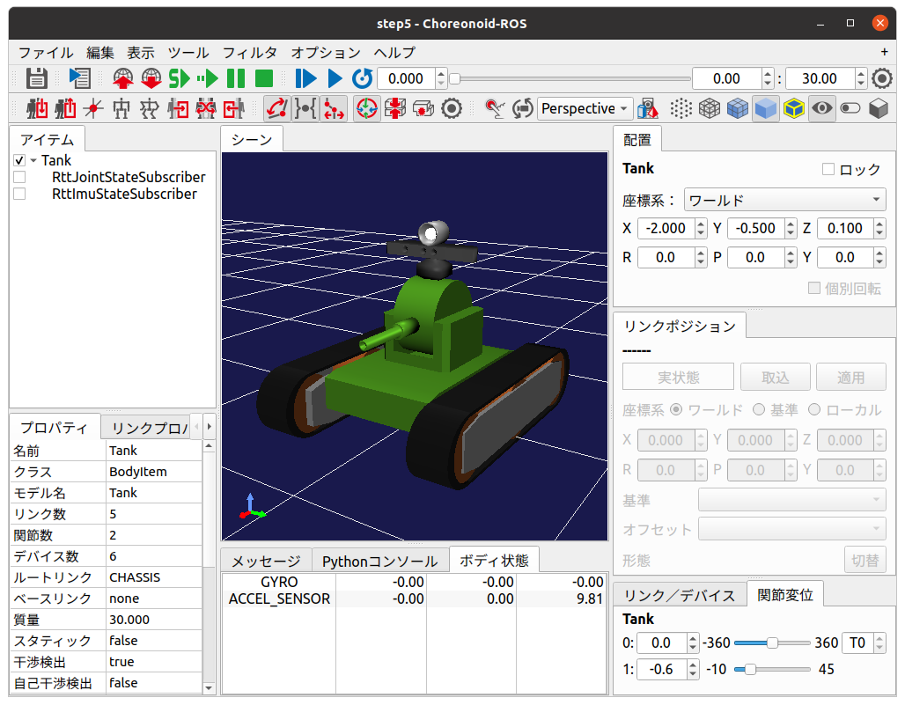
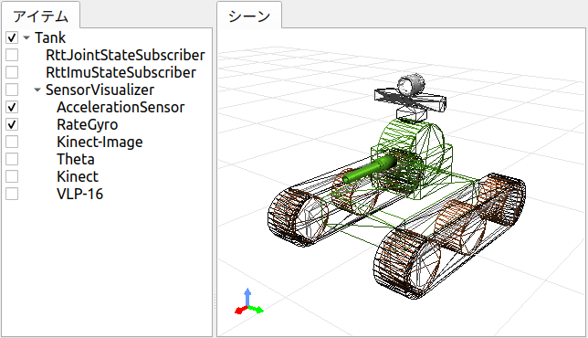

ステップ5: センサ情報トピックのSubscribeによるTank状態表示の強化
================================================================

ステップ5ではセンサ情報のトピックをSubscribeして利用する側のプログラムを作成します。

.. contents::
   :local:

概要
----

ステップ4ではTankロボットが搭載する加速度センサ、レートジャイロの状態をsensor_msgs/Imu型のROSトピックとして出力する機能を実装しました。このトピックをSubscribeすることで、ネットワーク経由でセンサの状態を取得し、様々な処理に活用することが可能となります。
ステップ5ではこの例として、ステップ3で構築した状態可視化用のChoreonoidノードにてセンサ情報のトピックをSubscribeし、Tankの状態表示を強化するものとします。

センサ状態取得用コントローラ
----------------------------
  
まず状態可視化用のChoreonoidノードにてセンサ情報のトピックをSubscribeする機能を実装します。
この機能はステップ3で導入した関節状態の可視化と同様に、シンプルコントローラによって実現することができます。
以下にそのソースコードを示します。

.. code-block:: c++
 :linenos:

 #include <cnoid/SimpleController>
 #include <cnoid/BodyItem>
 #include <cnoid/AccelerationSensor>
 #include <cnoid/RateGyroSensor>
 #include <cnoid/LazyCaller>
 #include <cnoid/Timer>
 #include <ros/node_handle.h>
 #include <sensor_msgs/Imu.h>
 #include <random>

 using namespace std;
 using namespace cnoid;

 class RttImuStateSubscriber : public SimpleController
 {
     unique_ptr<ros::NodeHandle> node;
     ros::Subscriber subscriber;
     BodyItemPtr bodyItem;
     AccelerationSensorPtr accelSensor;
     RateGyroSensorPtr gyro;
     Timer bodyShakeTimer;
     double bodyShakeDuration;
     Isometry3 bodyPosition;
     mt19937 mt;
     uniform_real_distribution<> rand;

 public:
     virtual bool configure(SimpleControllerConfig* config) override
     {
	 bodyItem = static_cast<BodyItem*>(config->bodyItem());

	 auto body = bodyItem->body();

	 accelSensor = body->findDevice<AccelerationSensor>();
	 if(accelSensor){
	     auto sigTimeout = bodyShakeTimer.sigTimeout();
	     if(!sigTimeout.hasConnections()){
		 sigTimeout.connect([this](){ onBodyShakeTimerTimeout(); });
		 bodyShakeTimer.setInterval(20);
	     }
	 }

	 gyro = body->findDevice<RateGyroSensor>();

	 node.reset(new ros::NodeHandle(bodyItem->name()));
	 subscriber = node->subscribe(
	     string("/") + bodyItem->name() + "/imu",
	     1,
	     &RttImuStateSubscriber::imuStateCallback, this);

	 return true;
     }

     void imuStateCallback(const sensor_msgs::Imu& state)
     {
	 callLater([this, state](){ updateImuState(state); });
     }

     void updateImuState(const sensor_msgs::Imu& state)
     {
	 if(accelSensor){
	     auto& dv = state.linear_acceleration;
	     accelSensor->dv() << dv.x, dv.y, dv.z;
	     accelSensor->notifyStateChange();
	     if(accelSensor->dv().head<2>().norm() > 20.0){
		 startBodyShake();
	     }
	 }
	 if(gyro){
	     auto& w = state.angular_velocity;
	     gyro->w() << w.x, w.y, w.z;
	     gyro->notifyStateChange();
	 }
     }

     void startBodyShake()
     {
	 bodyShakeDuration = 0.5;
	 if(!bodyShakeTimer.isActive()){
	     bodyPosition = bodyItem->body()->rootLink()->position();
	     rand.param(uniform_real_distribution<>::param_type(-0.02, 0.02));
	     bodyShakeTimer.start();
	 }
     }

     void onBodyShakeTimerTimeout()
     {
	 if(bodyShakeDuration > 0.0){
	     auto T = bodyPosition;
	     T.translation() += Vector3(rand(mt), rand(mt), rand(mt));
	     bodyItem->body()->rootLink()->setPosition(T);
	 } else {
	     bodyShakeTimer.stop();
	     bodyItem->body()->rootLink()->setPosition(bodyPosition);
	 }
	 bodyItem->notifyKinematicStateChange();
	 bodyShakeDuration -= 0.02;
     }

     virtual void unconfigure() override
     {
	 node.reset();
	 subscriber = ros::Subscriber();
	 bodyItem.reset();
	 accelSensor.reset();
	 gyro.reset();
         bodyShakeTimer.stop();
     }
 };

 CNOID_IMPLEMENT_SIMPLE_CONTROLLER_FACTORY(RttImuStateSubscriber)

このソースコードを "RttImuStateSubscriber.cpp" というファイル名でsrcディレクトリに作成し、同ディレクトリのCMakeLists.txtに以下の記述を加えてビルドします。

.. code-block:: cmake

 choreonoid_add_simple_controller(RttImuStateSubscriber RttImuStateSubscriber.cpp)
 target_link_libraries(RttImuStateSubscriber ${roscpp_LIBRARIES} Choreonoid::CnoidBodyPlugin)

ステップ3と同じ理由で "Choreonoid::CnoidBodyPlugin" をリンクするライブラリに指定する必要があります。

ビルドに成功すると "RttImuStateSubscriber.so" というファイル名でシンプルコントローラのバイナリファイルが生成されます。

センサ状態取得用コントローラの導入
----------------------------------

本コントローラはステップ3で作成した「状態可視化用Choreonoidノード」に導入して使用します。
それと組み合わせて使う「シミュレーション用Choreonoidノード」はステップ4のものを使用します。

そこでまずステップ3のプロジェクトファイルである "step3.cnoid" を本ステップ用に "step5.cnoid" というファイル名でコピーしてください。

そしてシミュレーション用の "step4.cnoid" とセットで起動するためのLaunchファイルを "step5.launch" というファイル名で作成します。
これは以下の内容とします。

.. code-block:: xml

 <launch>
   <node pkg="choreonoid_joy" name="choreonoid_joy" type="node" />
   <node pkg="choreonoid_ros" name="choreonoid" type="choreonoid"
	 args="$(find choreonoid_ros_tank_tutorial)/project/step4.cnoid --start-simulation" />
   <node pkg="rqt_graph" name="rqt_graph" type="rqt_graph" />
   <node pkg="choreonoid_ros" name="choreonoid2" type="choreonoid"
	 args="$(find choreonoid_ros_tank_tutorial)/project/step5.cnoid" />
 </launch>

ここまで作業を進めると、本チュートリアルのパッケージは以下のファイル構成になります。

.. code-block:: none

 + choreonoid_ros_tank_tutorial
   - CMakeLists.txt
   - package.xml
   + launch
     - step1.launch
     - step2.launch
     - step3.launch
     - step4.launch
     - step5.launch
   + project
     - step1.cnoid
     - step2.cnoid
     - step3.cnoid
     - step4.cnoid
     - step5.cnoid
   + src
     - CMakeLists.txt
     - RttTankController.cpp
     - RttJointStatePublisher.cpp
     - RttJointStateSubscriber.cpp
     - RttImuStatePublisher.cpp
     - RttImuStateSubscriber.cpp

作成したステップ5用のLaunchファイルを以下のコマンドで起動します。

.. code-block:: sh

 roslaunch choreonoid_ros_tank_tutorial step5.launch

すると2つのChoreonoidノードに対応するメインウィンドウがそれぞれ表示されます。
各Choreonoidノードのプロジェクト構成は以下のようになっているかと思います。

**シミュレーション用Choreonoidノード（step4.cnoid）**

.. code-block:: none

 + World
   + Tank
     - RttTankController
     - RttJointStatePublisher
     - RttImuStatePublisher
   - Labo1
   - AISTSimulator

**状態可視化用Choreonoidノード（step5.cnoid）**

.. code-block:: none

 + Tank
   - RttJointStateSubscriber

状態可視化用Choreonoidノードに対して、ステップ3で "RttJointStateSubscriber" を導入したのと同様に、上記の "RttImuStateSubscriber" を導入します。Tankを選択してメインメニューの「ファイル」−「新規」−「シンプルコントローラ」からシンプルコントローラアイテムを生成し、その「コントローラモジュール」として "RttImuStateSubscriber.so" を指定してください。
これによってアイテムツリーの構成は以下のようになります。

.. code-block:: none

 + Tank
   - RttJointStateSubscriber
   - RttImuStateSubscriber

これで加速度センサとレートジャイロの状態が状態可視化用のTankモデルに反映されるようになりました。
状態可視化用Choreonoidノードに対してプロジェクト保存の操作を行って、この構成をstep5.cnoidに保存するようにしてください。

ボディ状態ビューによるセンサ状態値の表示
----------------------------------------

上記の作業によってセンサの状態が状態可視化用のTankモデルに反映されるようにはなりましたが、これだけではセンサの状態を確認することができません。ステップ3で対象とした関節の状態については、関節角度をモデルに反映することでその外観から状態を確認できましたが、今回対象とするセンサについてはセンサの内部で状態値を有するだけであり、それらはモデル本体の外観には直接影響を与えないからです。

センサの状態を提示する方法はいろいろと考えられますが、まずはセンサの状態値をそのまま数値で表示してみることにします。
これについては、Choreonoidが標準で（Bodyプラグインによって）提供している「ボディ状態ビュー」を用いることで実現できます。

状態可視化用Choreonoidノードにおいて、メインメニューの「表示」−「ビューの表示」−「ボディ状態」を選択し、このビューを表示してください。デフォルトではメインウィンドウ中央下部のメッセージビューと重なる領域に表示されます。必要に応じて他の領域に移すなどして見やすい配置を実現してください。

状態可視化用Choreonoidノードにおいてこのビューを表示した状態を以下の図に示します。

このように、「ボディ状態ビュー」上に、Tankロボットが備えるレートジャイロ "GYRO" と加速度センサ "ACCEL_SENSOR" の状態値が表示されます。

ここでゲームパッドを操作してTankロボットの車体を動かしてみてください。するとセンサの値が変化することを確認できるかと思います。ステップ4の :ref:`ros_tank_tutorial_step3_check_topic_values` と同様に、車体を旋回させたり前後に動かすことで、それぞれGYROのZ軸成分（ボディ状態ビューの3カラム目の要素）とACCEL_SENSORのX軸成分（1カラム目）が変化します。これらの変化が比較的分かりやすいのではないかと思いますので、確認してみてください。

このようにして、センサ状態取得用のコントローラである "RttImuStateSubscriber" によって、実際にセンサの状態を取得できていることが分かります。これは内部的には「シミュレーション用Choreonoidノード」でシミュレーション中のTankロボットから "RttImuStatePublisher" によってPublishされるセンサ状態を、"RttImuStateSubscriber" によってSubscribeすることで実現しています。

ビューの追加を行ったので、この状態でプロジェクト保存を行って、次回起動時にもボディ状態ビューが表示されるようにしましょう。
ビューレイアウトの保存については、「ファイル」メニューの「プロジェクトファイルオプション」−「レイアウト」の項目にチェックが入っていることが必要ですので、その点も確認しておいてください。

衝突時の挙動
------------

今回のセンサ状態取得用コントローラでは、取得したセンサ情報を活用するひとつの例として、ロボットの衝突をアニメーションで提示する機能を入れています。これはロボットに大きな加速度が加わった状況をロボットの衝突と判断し、その際に状態可視化用のTankモデルの位置を一定期間ランダムに振動させるというものです。

実際にこの機能を試してみましょう。ゲームパッドを用いてシミュレーション用Choreonoidノード上のTankロボットを動かして、環境モデルの配管や装置などにわざと衝突させてください。ある程度速度をつけながら衝突させるとこの機能が発動しやすくなります。衝突によって20 [m/s^2] 以上の加速度が車体の水平方向に生じると、この機能が発動し、状態可視化用Choreonoidノードにて可視化用のTankモデルがあたかも衝突したかのように揺れるかと思います。

今回シンプルコントローラを用いてセンサ状態の取得を行っているので、コントローラに処理を実装することでこのような状態提示も可能となります。この機能を実現する実装内容については後ほど解説します。

センサ可視化アイテムの導入
--------------------------

センサ情報を提示する更なる手段として、センサによって得られた加速度や角速度の情報をシーンビュー上で視覚的にも表示してみましょう。
Choreonoidはこれを実現するための「センサ可視化アイテム」をやはり標準で（Bodyプラグインによって）提供しています。

センサ可視化アイテムは、メインメニューの「ファイル」−「新規」−「センサ可視化」から生成できます。
このアイテムは対象となるボディアイテムの子アイテムとして配置することで機能します。
そこでアイテムツリービュー上でTankアイテムを選択した状態でこのアイテムを生成するなどして、Tankアイテムの子アイテムとなるように配置してください。アイテムの名前はデフォルトのものでかまいません。

状態可視化用Choreonoidノードに対してこのアイテムを導入すると、アイテムツリーの構成は以下になります。

.. code-block:: none

 + Tank
   - RttJointStateSubscriber
   - RttImuStateSubscriber
   + SensorVisualizer

センサ可視化アイテムは複合アイテムとして機能するようになっており、対象モデルに備わっているセンサごとに対応するサブアイテムを生成します。そこでアイテムツリービュー上でSensorVisualizerアイテムを展開し、サブアイテムを表示してみましょう。するとツリー構成は実際には以下のようになっていることが分かります。

.. code-block:: none

 + Tank
   - RttJointStateSubscriber
   - RttImuStateSubscriber
   + SensorVisualizer
     - AccelerationSensor
     - RateGyro
     - Kinect-Image
     - Theta
     - Kinect
     - VLP-16

ここに表示されているサブアイテムとしては、まず加速度センサとレートジャイロに対応するものがあります。その下に続くのは視覚センサに対応するもので、Tankロボットが搭載する各視覚センサをそれぞれの名前で対応づけています。これらの各サブアイテムのチェックを入れると、そのアイテムの可視化が行われます。ただし視覚センサについては今回のコントローラではデータの取得を行っていないので、チェックを入れても何も表示されません。視覚センサデータの可視化についてはまたあらためて紹介したいと思います。

今回は加速度センサとレートジャイロの可視化を行うので、対応する "AccelerationSensor" と "RateGyro" のチェックをオンにしてください。
すると現在の加速度と角速度がシーンビュー上に矢印形状のマーカで可視化されるようになります。

ただしそれらのマーカがTankモデルと重なってしまい、値があまり大きくないときはその中に隠れて見えなくなってしまいます。
そこでマーカをみやすくするため、シーンビューをワイヤフレーム表示に切り替えておきましょう。
シーンビューのツールバーで「ワイヤフレーム表示」のボタンを以下のようにオンにすることで、表示を切り替えることができます。

また、さらにマーカを見やすくするために、シーンビューの背景色を変えておくのもよいかと思います。
これはシーンビューのツールバー右端の設定ボタンを押して表示される設定ダイアログで変更できます。
ダイアログ上の「背景色」のボタンを押すと色の選択ダイアログが表示されるので、そこで適当に色を選択してください。
ここでは白に設定しておくとよいかと思います。

以上の設定を適用したアイテムツリービューとシーンビューの表示を以下に示します。

ここでシミュレーション中のTankロボットをゲームパッドで操作して動かしてみましょう。
するとシーンビュー上に赤と青の矢印が表示されるかと思います。
赤が加速度に対応するもので、青が角速度に対応するものです。
例えば左旋回しながら前方に加速させたときのマーカ表示は以下のようになります。

.. image:: images/sensor-visualizer-markers.png
    :scale: 70%

赤色矢印の方向と長さが加速度の方向と大きさに対応しています。
ここでは前方に加速していることを視覚的にひと目で把握できるかと思います。
青色矢印で表示されている角速度については、いわゆる回転ベクトルの表示となっています。矢印の向きが回転に対する右ねじの方向で、長さが回転角速度の大きさに対応します。

なお、加速度の可視化においては、デフォルトでZ軸方向に重力加速度に相当するオフセットが付与されています。
これにより、加速度センサが静止している際に矢印マーカーの長さ（加速度の大きさ）が0になるようにしています。
これはAccelerationSensorアイテムの「オフセット」プロパティで設定されていて、デフォルトでは

.. code-block:: none

 0.0 0.0 -9.8

となっています。これはセンサローカル座標のX、Y、Z軸に対応していて、Z軸に-9.8のオフセットを付与することで、重力によって計測される加速度成分をキャンセルしています。

センサ可視化用のサブアイテムはこれも含めて可視化に関する以下の3つのプロパティを備えています。
必要に応じてこれらのプロパティを調整することで、センサの状態をより見やすく表示することができます。

* 表示比率

  * センサ状態値のベクトルの大きさに対するシーンビュー上でのマーカの長さの比率を設定します。

* 表示閾値

  * センサ状態値のベクトルの大きさがこの閾値以上のときにマーカを表示します。

* オフセット

  * 上記のオフセットベクトルを設定します。

センサ可視化アイテム導入後の状態にもプロジェクト保存を適用して、この状態をプロジェクトファイルに保存しておきましょう。

ソースコードの解説
------------------

今回導入したコントローラRttImuStateSubscriberのソースコードを解説します。

ソースコードの基本的な構造はステップ3のRttJointStatePublisherと同じです。
そこでは関節変位等を格納するJointState型のトピックを入力の対象とし、可視化用Bodyモデルの関節変位が更新の対象でした。
それに対して本コントローラでは角速度と加速度を格納するImu型のトピックが入力対象となり、可視化用Bodyモデルのデバイスオブジェクトが更新の対象となる点が異なります。
また、その処理に加えて、一定以上の大きさの加速度を検知したときに、Bodyモデルを振動させる処理が加わります。

.. highlight:: c++

ヘッダのインクルード
~~~~~~~~~~~~~~~~~~~~

まず今回更新の対象が加速度センサとレートジャイロになりますので、それらに対応するヘッダをインクルードしています。 ::

 #include <cnoid/AccelerationSensor>
 #include <cnoid/RateGyroSensor>

またSubscribe対象のメッセージ型であるImu型のヘッダもインクルードします。 ::

 #include <sensor_msgs/Imu.h>

このあたりは対象とするデータ型やオブジェクトが同じであるステップ4と同様ですね。

さらに、モデルを振動させる処理でタイマと乱数を使用するため、それらに対応するヘッダをインクルードしています。 ::

 #include <cnoid/Timer>
 ...

 #include <random>

残りのヘッダはステップ3と同様にトピックのSubscribeに必要となるものです。

メンバ変数
~~~~~~~~~~

ステップ3のコントローラに対して新たに導入されたメンバ変数を解説します。まず ::

 AccelerationSensorPtr accelSensor;
 RateGyroSensorPtr gyro;

については更新対象のセンサオブジェクトを格納する変数です。

また、以下の変数は衝突検知時にモデルを振動させる処理で必要となる変数です。 ::

 Timer bodyShakeTimer;
 double bodyShakeDuration;
 Isometry3 bodyPosition;
 mt19937 mt;
 uniform_real_distribution<> rand;

これらの詳細は後ほど解説します。

初期化処理
~~~~~~~~~~

初期化処理はステップ3と同様にconfigure関数に実装しています。

加速度センサについては以下のコードで取得しています。 ::

 accelSensor = body->findDevice<AccelerationSensor>();

加速度センサがみつかった場合は、モデル振動処理のための準備を行います。 ::

  if(accelSensor){
      auto sigTimeout = bodyShakeTimer.sigTimeout();
      if(!sigTimeout.hasConnections()){
	  sigTimeout.connect([this](){ onBodyShakeTimerTimeout(); });
	  bodyShakeTimer.setInterval(20);
      }
  }

bodyShakerTimerはTimer型のオブジェクトです。
これはQtのQTimerクラスについて、Choreonoidのシグナル型を使えるようにしたものです。
ここで使用しているsigTimeoutは、タイマが指定した時間間隔に達した（タイムアウトした）時に送出されるシグナルです。
ここではこのシグナルをonBodyShakeTimerTimeout関数を紐付けており、タイムアウトしたときにこの関数が呼ばれるようにしています。
またタイマの時間間隔を20ミリ秒に設定しています。
このタイマによって一定の時間間隔でモデルを振動させることで、モデルが衝突したことを表現するアニメーションを実現します。

なお、この初期化処理は本コントローラ生成後に一度だけ行えばよいので、既に初期化済みの場合はこの処理をスキップしています。
初期化済みかどうかは ::

 if(!sigTimeout.hasConnections()){
     ...
 }

で判定しています。
configure関数は、コントローラアイテムの移動などに伴い複数回呼ばれることがあるので、この判定が必要となります。

レートジャイロについても取得しておきます。 ::

 gyro = body->findDevice<RateGyroSensor>();

Subscriber用のノードハンドルを生成し、Subscriberを生成します。 ::

 node.reset(new ros::NodeHandle(bodyItem->name()));
 subscriber = node->subscribe(
     string("/") + bodyItem->name() + "/imu",
     1,
     &RttImuStateSubscriber::imuStateCallback, this);

この処理はステップ3と同様です。

トピック名は "/モデル名/imu" としており、実際には "/Tank/imu" となります。
これはステップ4で作成したコントローラがPublishするトピックと同じ名前になります。

ここでコールバック関数として設定されている以下の関数 ::

 void imuStateCallback(const sensor_msgs::Imu& state)
 {
     callLater([this, state](){ updateImuState(state); });
 }

によって、トピックのSubscribe時に最終的にupdateImuState関数がメインスレッドから実行されます。

センサオブジェクトの状態更新
~~~~~~~~~~~~~~~~~~~~~~~~~~~~

トピックのSubscribe時に実行されるupdateImuState関数で、可視化用モデルが有するセンサオブジェクトの状態更新が行われます。 ::

 if(accelSensor){
     auto& dv = state.linear_acceleration;
     accelSensor->dv() << dv.x, dv.y, dv.z;
     accelSensor->notifyStateChange();
     ...

加速度センサが存在する場合は、その加速度の値をSubsribeした値で更新します。
更新後にセンサオブジェクトのnotifyStateChangeを実行して、この更新を通知します。
更新の通知はセンサオブジェクトのsigStateChangedシグナルを用いて行われます。
ボディ状態ビューやセンサ可視化アイテムはこのシグナルと接続されており、通知に伴って表示も更新されます。 ::

     ...

     if(accelSensor->dv().head<2>().norm() > 20.0){
	 startBodyShake();
     }
 }

加速度の水平（X、Y）成分のベクトルの大きさが20.0 [m/s^2] より大きい場合は、Tankロボットが衝突したものと判断して、可視化用モデルを揺らすアニメーションを開始します。

レートジャイロについても同様に更新処理を行います。 ::

  if(gyro){
      auto& w = state.angular_velocity;
      gyro->w() << w.x, w.y, w.z;
      gyro->notifyStateChange();
  }

こちらは加速度センサのように付加的な処理はありません。

モデル振動アニメーション
~~~~~~~~~~~~~~~~~~~~~~~~

モデルを振動させるアニメーションは、以下の関数を実行することで開始します。 ::

 void startBodyShake()
 {
     bodyShakeDuration = 0.5;
     if(!bodyShakeTimer.isActive()){
	 bodyPosition = bodyItem->body()->rootLink()->position();
	 rand.param(uniform_real_distribution<>::param_type(-0.02, 0.02));
	 bodyShakeTimer.start();
     }
 }

bodyShakeDurationは、アニメーションの実行時間です。ここでは0.5秒に設定しています。

次にタイマの稼働状況をチェックしています。bodyShakerTimerのisActive関数がtrueを返す場合はタイマが稼働しており、現在アニメーションを実行中ということになるので、それを継続することになります。

タイマのisActiveがfalseの場合はまだタイマが稼働していないので、bodyShakeTimerのstart関数を実行してタイマを稼働させます。その際にアニメーションに関る初期化として、振動の中心位置を格納するbodyPositionを現在のモデルの位置で初期化し、振動の相対位置を決めるために使用する乱数オブジェクトも初期化しています。乱数についてはdouble型で-0.02から0.02の範囲の値を返す設定としています。 ::

 void onBodyShakeTimerTimeout()
 {
     ...
 }

アニメーション用のタイマによって周期的に呼ばれる関数です。ここで実際にモデルを振動させています。 ::

 if(bodyShakeDuration > 0.0){
     auto T = bodyPosition;
     T.translation() += Vector3(rand(mt), rand(mt), rand(mt));
     bodyItem->body()->rootLink()->setPosition(T);
 } ...

アニメーション中であれば、振動中心位置からX、Y、Z軸それぞれについて乱数で生成した値分ずらした位置を生成し、その位置でモデルの位置を更新します。これが20ミリ秒毎に0.5秒間繰り返されることにより、モデルが振動しているように見えます。 ::

     ...

 } else {
     bodyShakeTimer.stop();
     bodyItem->body()->rootLink()->setPosition(bodyPosition);
 }

bodyShakeDurationが0以下になるとアニメーションを終了させます。
タイマを停止し、モデルの位置を元の位置（振動中心位置）に戻します。 ::

 bodyItem->notifyKinematicStateChange();

モデルの更新を通知します。 ::

 bodyShakeDuration -= 0.02;

アニメーションの終了までの時間をタイマの周期分減らします。
上記のようにこれが0以下になるとアニメーションを終了します。

終了処理
~~~~~~~~

ステップ3と同様に、コントローラの終了処理をunconfigure関数で行います。 ::

 virtual void unconfigure() override
 {
     node.reset();
     subscriber = ros::Subscriber();
     bodyItem.reset();
     accelSensor.reset();
     gyro.reset();
     bodyShakeTimer.stop();
 }

Subscribeを停止し、関連するオブジェクトのポインタをクリアし、アニメーション用のタイマを停止しています。
