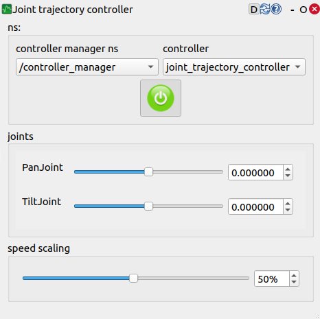

ros2_controlの利用
==================

`ros2_control <https://control.ros.org/humble/index.html>`_ は、ROS 2環境でのロボット制御のためのフレームワークです。ハードウェア抽象化とモジュラー設計を特徴としており、様々な種類の標準コントローラが用意されています。位置制御、速度制御、軌道制御など、目的に合わせたコントローラを選択・組み合わせることで、独自のコントローラを開発することなく効率的にロボットの制御システムを構築できます。また、プラグイン構造を採用しているため、必要に応じて新しいコントローラの追加も容易です。これにより、開発者はハードウェアの詳細を気にせず、ロボットアプリケーションの開発に集中できます。

Choreonoidでもこのros2_controlを利用できるようにするための改良を現在進めています。
これにより、Choreonoid上のシミュレーションにおいて仮想ロボットをros2_controlで制御できるようになります。
現在この機能はROS 2 Humbleを対象としたベータ版として利用することが可能です。
ここではベータ版でサンプルを動かすまでの手順を紹介します。

.. contents::
   :local:

.. highlight:: sh

ros2_control対応ベータ版のブランチ
----------------------------------

ros2_controlに対応したROS2プラグインは、現在choreonoid_rosパッケージの "feature/ros2-control-beta" ブランチで開発を進めています。
choreonoid_rosパッケージのリポジトリを最新版に更新し、ローカルリポジトリで ::

  git checkout feature/ros2-control-beta

を実行して、ros2_control対応版のブランチに切り替えてください。

この状態で :ref:`install-choreonoid-ros2-dependencies` と、 :ref:`choreonoid_rosのビルド <ros2_colcon_build_command>` を実行すると、ros2_controlを利用できるようになります。

ROS2Controlアイテム
-------------------

ros2_control対応版のROS2プラグインでは、「ROS2Controlアイテム」を利用できるようになります。
ROS2Controlアイテムは、メインメニューの「ファイル」−「新規」−「ROS2Control」から生成します。
生成したアイテムをロボットの子アイテムとして配置することで、ロボットをros2_controlで制御できるようになります。

ros2_controlの設定
------------------

上記のようにROS2Controlアイテムを配置したシミュレーションプロジェクトが用意できたら、以下の手順でros2_controlの設定をChoreonoidに取り込むようにします。

* ロボットのURDFを用意する
   * ros2_controlでは制御対象のロボットのURDFが必要となります。
* ros2_controlのパラメータをYAMLファイルに記述する
   * ros2_controlの設定はROS2パラメータとして与えます。これを行うため、まずパラメータをYAMLファイルに記述しておきます。
* launchファイルを作成する
   * ロボットのURDFとros2_control用のパラメータを利用できる状態でChoreonoidを起動するlaunchファイルを作成します

launchファイルには以下の処理を記述します。

* Choreonoidを起動する。この際以下の処理を行う。
   * 対象のシミュレーションプロジェクトを読み込む
   * ros2_control用のROS2パラメータをセットする
* ロボットのURDFをpublishするrobot_state_publisherを起動する
* controller_managerパッケージのspawnerを用いて、必要なコントローラをマネージャ上にロードする
* 他に必要なROSノードやツールがあれば起動する

これらの具体的な記述については、以下で紹介するサンプルを参考にしてください。

ros2_control利用サンプル
------------------------

ros2_controlを用いてChoreonoid上の仮想ロボットを制御するサンプルとして、 :doc:`ros2-mobile-robot-tutorial` におけるロボットの制御をros2_controlに置き換えたサンプルを用意しました。サンプルはこのチュートリアルのリポジトリに含まれており、ブランチを "ros2-control" に切り替えることで利用できます。

サンプルのビルド、実行は基本的に :doc:`ros2-mobile-robot-tutorial` と同様の手順で進めることになりますので、そちらの解説スライドも参照ください。以下ではサンプルを実行するまでの手順を簡単に説明します。ワークスペース上のChoreonoid本体とchoreonoid_rosのパッケージは最新の状態になっているものとします。

まずチュートリアルのパッケージ（リポジトリ）をROS2ワークスペースのsrcディレクトリにクローンします。 ::

  cd ~/ros2_ws/src
  git clone https://github.com/choreonoid/choreonoid_ros2_mobile_robot_tutorial

（すでにリポジトリをsrc以下に取得している場合は、最新版にアップデートしてください。）

リポジトリのブランチを "ros2-control" に切り替えます。 ::

  cd choreonoid_ros2_mobile_robot_tutorial
  git checkout ros2-control

ビルドを行います。 ::

  cd ~/ros2_ws
  colcon build --symlink-install

以下のコマンドでサンプルのlaunchファイルを起動します。 ::

  ros2 launch choreonoid_ros2_mobile_robot_tutorial sensors_display_ros2_control_pid_launch.xml

すると以下の画面のようにChoreonoidとrqtが起動し、モバイルロボットのシミュレーションが開始します。

このサンプルは :doc:`ros2-mobile-robot-tutorial` に沿ったものとしており、モバイルロボットの車体は "/cmd_vel" トピックを介して制御するようになっています。launchファイルで起動されるrqt_robot_steeringのインタフェースでこれを行えるようにしてあります。

ただし/cmd_velトピックについて、タイムスタンプが付与される "TwistStamped" 型のメッセージである必要があります。このため、下図のようにrqt_robot_steeringの "stamped" のチェックを入れて、このメッセージ型になるようにしてください。

このようにしておくと、rqt_robot_steeringの縦と横のスライダを操作することで、車体の前進後退、旋回を行うことができます。

車体の制御にはros2_controlの "diff_drive_controller" を使用しています。diff_drive_controllerは、差動駆動型（二輪）ロボット用のコントローラーで、cmd_vel（速度指令）を受け取り、左右ホイールの速度に変換して制御を行います。ホイール径や車輪間距離などの設定が可能で、オドメトリ情報の計算・発行も行います。

このサンプルではロボットのパンチルト関節も制御することができます。それにはrqt内に同時に表示されているrqt_joint_trajectory_controllerを使用します。

そのためにはまず "controller manager ns" のコンボをクリックして、"/controller_manager" を選択し、その後 "controller" のコンボをクリックして "joint_trajectory_controller" を選択します。その状態で電源ボタンのアイコンをクリックすると、ボタンが赤から緑に変化し、以下の図に示す状態になります。

この状態で "PanJoint" や "TiltJoint" のスライダを動かすと、それに従ってロボットのパンチルト軸が動きます。また、"speed scaling" の値を変えることで、動作速度も調整することができます。

パンチルト軸の制御にはros2_controlの "joint_trajectory_controller" を使用しています。joint_trajectory_controllerは複数の関節の位置や速度を時系列で制御するためのコントローラーで、"trajectory_msgs/JointTrajectory" メッセージを受け取り、設定された時間に従って各関節を目標位置・速度に移動させます。ロボットアームなどの多関節機構の協調制御に広く使用されています。

Actuation modeの使い分けについて
--------------------------------

本サンプルでは、以下の2つのlaunchファイルのバージョンを用意しています。

1. sensors_display_ros2_control_pid_launch.xml
2. sensors_display_ros2_control_launch.xml

これらはロボットへの制御指令の与え方は同じですが、Choreonoidの物理エンジン側での仮想ロボットに対する出力（指令値）が異なります。1は物理エンジンにトルク値を出力するようになっており、ros2_controlのコントローラが計算した角速度の指令値に対して、さらにPID制御によってトルク指令値を計算し、それを物理エンジンに出力するようにしています。一方で、2については、ros2_controlのコントローラが計算した角速度の指令値をそのまま物理エンジンに出力するようにしています。

これは :doc:`../simulation/howto-implement-controller` で説明している :ref:`simulation-implement-controller-actuation-mode` が異なるということになります。1についてはJointEffortを、2についてはJointVelocityのモードを利用しています。他には関節角度を指令値とするJointDisplacementのモードもあります。

このアクチュエーションモードについては、制御しやすいモードを利用するのがよいのですが、物理エンジンによって適切なモードが異なる場合があります。具体的には、産総研エンジン（AISTシミュレータアイテム）の場合は、基本的には力／トルクで物理計算を行うようになっており、JointEffortのモードを使用することが望ましいです。JointVelocityやJointDisplacementについては、その指令値をシミュレーションの計算ステップごとに必ず実現するという特殊な計算方法（ハイゲインモード）になっており、想定外の挙動となる場合があります。一方で、AGXDynamicsをはじめとするいくつかの物理エンジン（シミュレータアイテム）では、JointVelocityやJointDisplacementを使用した場合も安定にシミュレーションを行うことができます。

このこともあり、本サンプルでは上記の2つのバージョンを用意しています。AISTシミュレータアイテムを使用してシミュレーションを行う場合は、1のバージョンを使用するのが適切です。自身のシミュレーションでの使用においても、AISTシミュレータアイテムを用いる場合は、1と同様の設定をするようにしてください。

