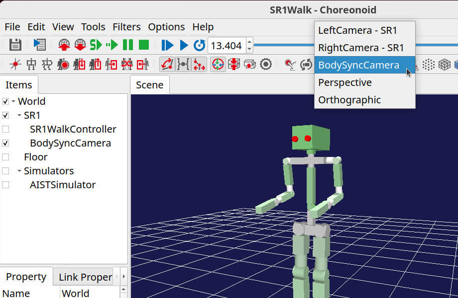
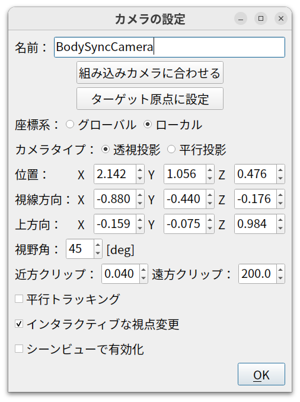

ボディ同期カメラの使い方
========================

.. 英訳指示：「ボディ同期カメラ」は "BodySyncCamera" としてください。

ボディ同期カメラは、ロボットをはじめとするボディモデルの動きに合わせて動くカメラです。
シミュレーション等でボディモデルが動く際に、シーンビューの描画にこのカメラを選択すると、ボディの移動に合わせてカメラも移動するので、ロボットを追いかけるように表示してくれます。ここではこのカメラの使い方を説明します。

ボディ同期カメラアイテムの作成
------------------------------

メニューから、 **ファイル** ー **新規** ー **ボディ同期カメラ** と選択してボディ同期カメラアイテムを作成し、
同期させたいボディアイテムの子アイテムとして配置します。
アイテムには他のカメラと区別できるように名前をつけておきます。
また、アイテムにはチェックを入れておきます。

以下に "SR1Walk.cnoid" のサンプルにボディ同期カメラを導入する際の、アイテムツリービューの状態を示します。

.. image:: images/body_sync_camera_item_tree_view.png

ここではSR1ロボットの動きに同期させようとしているので、SR1アイテムの子アイテムとしてカメラアイテムを導入しています。
対象ボディアイテムの子アイテムなっていないと、ボディの動きに同期することはありませんので、ご注意ください。

.. _body_sync_camera_selection:

ボディ同期カメラの選択
----------------------

ボディ同期カメラアイテムにチェックを入れると、シーンバーの「描画用カメラ選択コンボ」にアイテムに対応するカメラが表示されるようになりますので、これを選択します。シーンビューのカメラの選択については、 :ref:`basics_sceneview_change_camera` をご覧ください。

以下はSR1Walkプロジェクトでのカメラの選択の例です。

この状態で、マウス操作による視点の変更も可能ですので、見やすい視点に調整しておきます。

カメラの同期
------------

対象となるボディが動くと、カメラもそれに連動して動くようになります。
正確には、ボディのルートリンクとカメラとの相対位置関係が保たれるようになります。

例えばSR1Walkのプロジェクトでは、シミュレーションを開始してSR1ロボットが歩行すると、その動作にカメラも追従するようになります。

対象のボディモデルの位置が変わればそれに連動するので、シミュレーションに限らず、タイムバーや配置ビュー等の操作でボディの位置が変化する場合にも、それに連動するようになります。

コンテキストメニュー
--------------------

アイテムツリービュー上でアイテムを右クリックするとコンテキストメニューが表示されますが、
ボディ同期カメラのコンテキストメニューでは以下の3つの項目が先頭に表示されます。

* このカメラを使用
* 組み込みカメラに適用
* カメラの設定

.. 英訳指示： 上の３つの項目はそれぞれ "Activate camera", "Apply to built-in camera", "Camera configuration" としてください。

「このカメラを使用」を選択すると、そのカメラがシーンビューで使用するカメラになります。
:ref:`body_sync_camera_selection` で説明した、カメラ選択コンボによる選択と同じ結果となります。

「組み込みカメラに適用」を選択すると、シーンビューにデフォルトで組み込まれているカメラ（「透視投影」と「並行投影」のカメラ）にボディ同期カメラの視点を適用した上で、シーンビューで使用するカメラを組み込みカメラに切り替えます。

「カメラの設定」については次節で説明します。

カメラの設定
------------

コンテキストメニューの「カメラの設定」を選択すると、以下に示すカメラ設定用のダイアログが表示されます。

ここで設定できる項目は以下のとおりです。

.. tabularcolumns:: |p{3.5cm}|p{11.5cm}|

.. list-table::
 :widths: 25,75
 :header-rows: 1

 * - 設定項目
   - 意味
 * - 名前
   - アイテムの名前です。カメラの名前としても使用されます。
 * - 組み込みカメラに合わせる
   - このボタンを押すと、カメラの設定を組み込みカメラに合わせるように設定します。
 * - ターゲット原点に設定
   - カメラの位置をターゲット（対象ボディ／リンク）の原点位置に設定します。
 * - 座標系
   - このダイアログで設定するカメラ位置・姿勢の座標系をグローバルにするかターゲットからのローカル座標にするか選択します。
 * - カメラタイプ
   - カメラの投影タイプを選択します。
 * - 位置
   - カメラの位置を設定します。
 * - 視線方向
   - カメラの視線方向を設定します。
 * - 上方向
   - カメラの上方向を設定します。
 * - 視野角
   - カメラの視野角を設定します。
 * - 近方クリップ
   - 近方側のクリッピング距離を設定します。
 * - 遠方クリップ
   - 遠方側のクリッピング距離を設定します。
 * - 並行トラッキング
   - このチェックを入れると、カメラの姿勢（向き）は変化させずに、カメラの位置だけをターゲットに同期させるようにします。
 * - インタラクティブな視点変更
   - このチェックを入れると、カメラの位置・姿勢をマウスによる視点変更操作でインタラクティブに変更できるようになります。
 * - シーンビューで有効化
   - このチェックを入れると、シーンビューで使用するカメラとなります。

.. 英訳指示： 「組み込みカメラに合わせる」→ "Align with the builtin camera", 「ターゲット原点に設定」→ "Align with the target origin", 「座標系」→ "Coordinate System", 「カメラタイプ」→ "Camera type", 「位置」→ "Position", 「視線方向」→ "Look-at", 「上方向」→ "Up vector", 「視野角」→ "Field of View", 「近方クリップ」→ "Near Clip", 「遠方クリップ」→ "Far Clip", 「並行トラッキング」→ "Parallel tracking", 「インタラクティブな視点変更」→ "Interactive viewpoint change", 「シーンビューで有効化」→ "Activate in the scene view"

プロパティ
----------

ボディ同期カメラは以下のプロパティでも設定することができます。

.. tabularcolumns:: |p{3.5cm}|p{11.5cm}|

.. list-table::
 :widths: 25,75
 :header-rows: 1

* カメラタイプ
* 視野角
* 近方クリップ距離
* 遠方クリップ距離
* インタラクティブな視点変更
* 対象リンク
* 並行トラッキング

「対象リンク」にリンク名を指定することで、対象ボディのルートリンク以外のリンクを同期の対象とすることができます。
それ以外のプロパティは、設定ダイアログの項目と同じです。

.. 英訳指示： 「対象リンク」→ "Target link"
