.. 英訳指示：このページは英訳済みのものがあるので、英訳しないでください。

ゲームパッドの利用
==================

Choreonoidでは、ゲームパッドの入力を利用することで、コントローラからロボットに与える指令値を変更することができます。ここでは、ゲームパッドの使い方とChoreonoidが提供する "Joysitick" クラスについて説明します。

ゲームパッドの動作確認
----------------------

ゲームパッドがOSに認識されているか、軸やボタンの配置はどうなっているかを確認します。

Ubuntuの場合
~~~~~~~~~~~~~~

Ubuntuでは、"jstest-gtk" というアプリケーションが利用できます。ゲームパッドがうまく機能しない場合はこのアプリケーションで確認するようにして下さい。コマンドラインから ::

 sudo apt install jstest-gtk

を実行することでインストールされ、 ::

 jstest-gtk

と入力することで起動します。以下は、Xbox ワイヤレス コントローラーを接続してjstest-gtkを起動したときの画面例です。

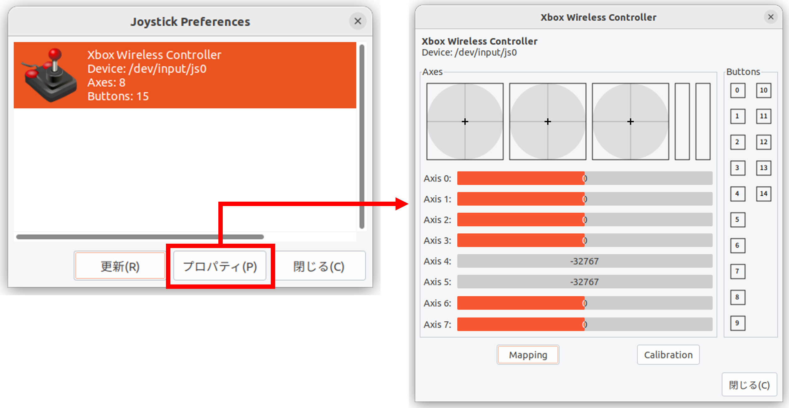

ここで **Device:** は、ゲームパッドのデバイスファイルを表しています。ここで "js0" というのは最初に接続されたIDが0番のゲームパッドということで、通常はこれを使います。2台目以降のゲームパッドを使いたい場合はjs1、js2といったデバイスを使いますが、その場合はソースコードの変更が必要になりますのでご注意下さい。

プロパティを開くと、ゲームパッドの情報が表示されます。ここでゲームパッドの軸やボタンを操作すると出力内容が変わりますので、これで接続状態や軸・ボタンの配置を確認できます。このような出力がされなかったり、ゲームパッドを操作しても出力内容が変わらない場合は、うまく接続されていませんので、接続方法やゲームパッドの状態を確認するようにして下さい。

Windows 11の場合
~~~~~~~~~~~~~~~~

コントロールパネルを開き、デバイスとプリンターを選択します。下図のように表示されたゲームパッドを右クリックし、ゲームコントローラの設定を開きます。以下は、Xbox ワイヤレス コントローラーを接続したときの画面例です。

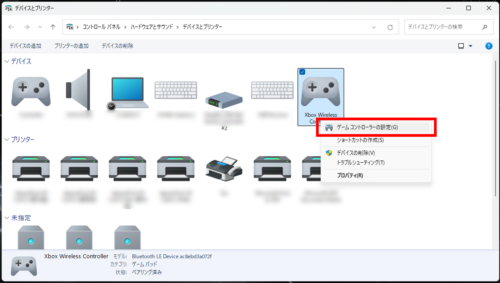

コントローラを選択し、プロパティをクリックするとテスト画面が開きます。ゲームパッドを操作して画面表示が変化することを確認してください。出力内容が変わらない場合は、うまく接続されていませんので、接続方法やゲームパッドの状態を確認するようにして下さい。

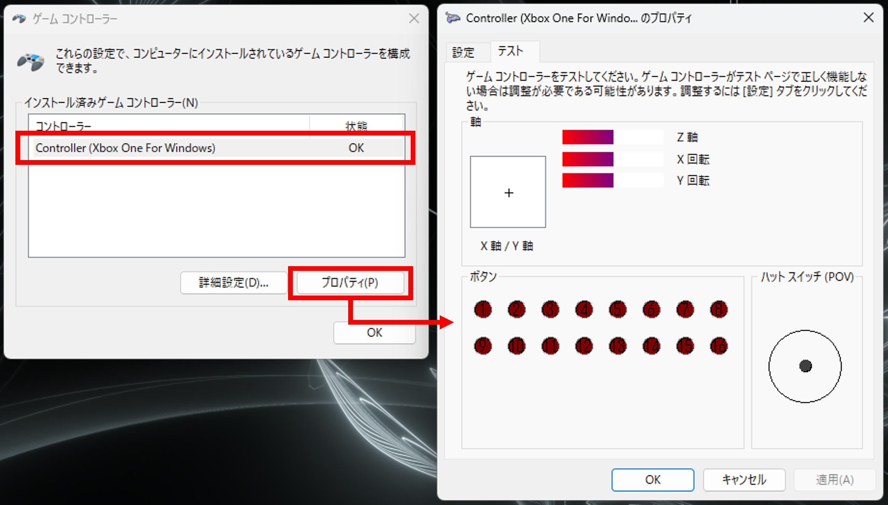

次に、ゲームコントローラの設定に戻り、詳細設定をクリックします。優先デバイスで、使用したいゲームパッドを選択します。複数のゲームパッドを接続している場合は必ず行ってください。

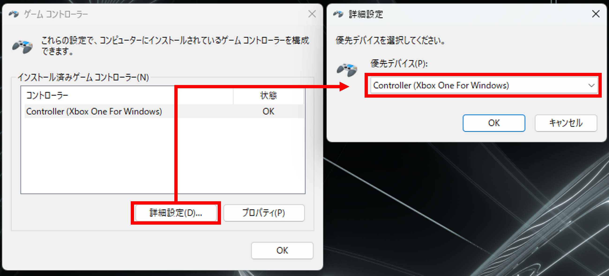

.. note:: 複数のゲームパッドを繋いだり、外したりすると、優先デバイスを指定してもChoreonoidでゲームパッドが認識されなくなる場合があります。そのような場合は、Windowsを再起動し、ゲームパッドを一つだけ接続してみてください。

Windows 11でゲームバーを消す
""""""""""""""""""""""""""""

Windows11で、Xbox用のゲームパッドを使用する場合、ゲームパッドの真ん中にあるロゴが描かれたボタンを押すと、ゲームバーというアプリが起動してしまうことがあります。以下のように設定することで、起動しないようにすることができます。

Windowsの設定を開き、**ゲーム** を選択します。

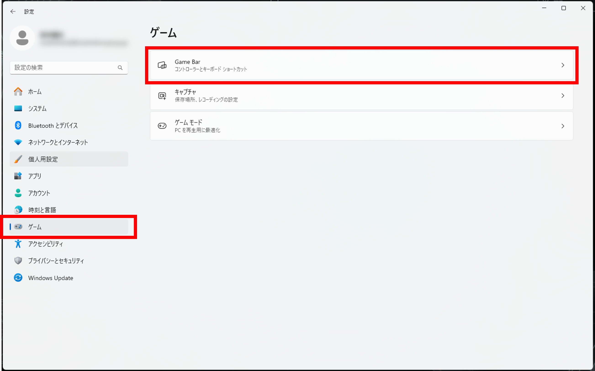

**Game Bar** を選択し、**コントローラがGameBarを開くことを許可する：** を **オフ** に切り替えます。

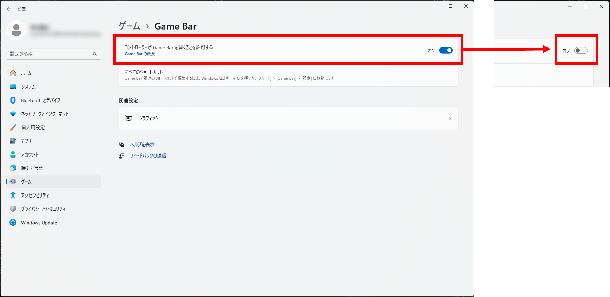

Joystickクラス
--------------

ゲームパッドは、機種によってマッピング（軸やボタンの配置[ID値の対応>]）が異なる場合があります。ここでは、以下の **DUALSHOCK 4** と **Xbox ワイヤレス コントローラー** を接続した場合を例に説明します。

.. image:: images/controllers.png

これらのゲームパッドを接続したとき、jstest-gtkでは以下のようにゲームパッドの情報が表示されます。

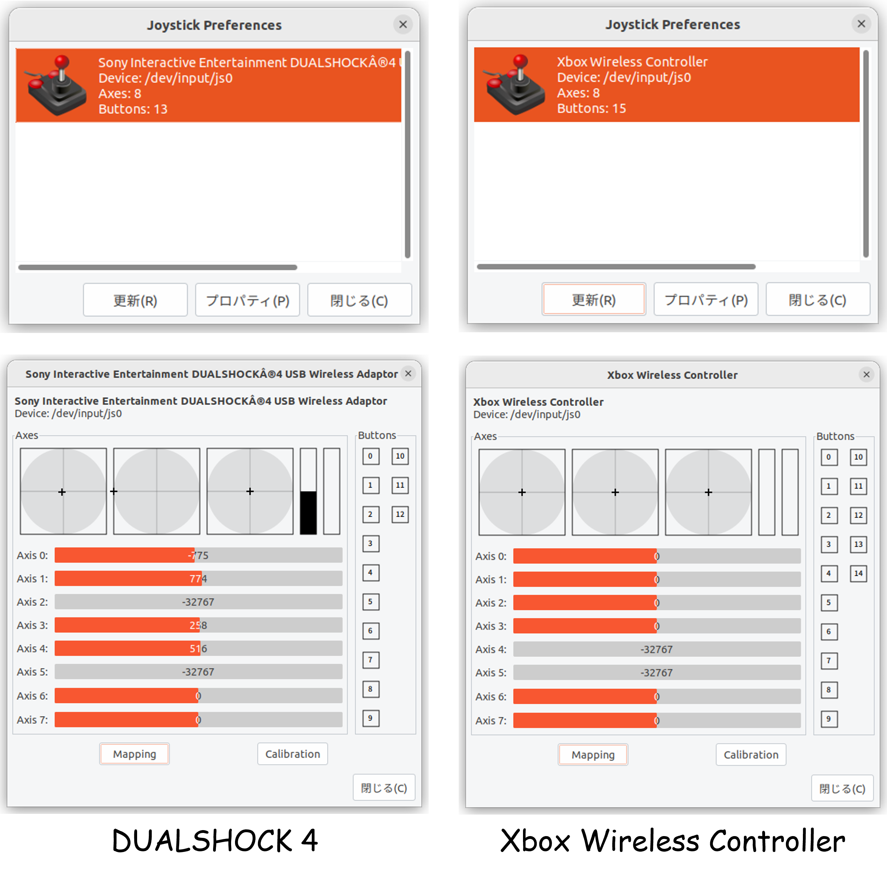

このときのゲームパッドのマッピングはそれぞれ以下のようになっており、軸やボタンの配置が異なることがわかります。

.. image:: images/axis_map_raw.png

.. image:: images/button_map_raw.png

このようにゲームパッドのマッピングが異なる場合、コントローラからゲームパッドの入力がうまく取得できず、シミュレーション中のロボットを正しく操作できなくなることがあります。

このマッピングの差異に対応するために、Choreonoidでは、ゲームパッドの機種毎のマッピングを共通の配置に補正する機能を備えた "Joysitick" クラスを提供しています。Joystickクラスは、ゲームパッドの入力を取得するためのクラスであり、シンプルコントローラからロボットに与える指令値を変更する場合等に利用できます。このJoystickクラスでは、上述のゲームパッドのマッピングが以下のように補正されます。

.. image:: images/axis_map_cnoid.png

.. image:: images/button_map_cnoid.png

上図のようにゲームパッドのマッピングを補正することで、異なる機種のゲームパッドを使用した場合でも入力をうまく取得できるようになります。

現在（2025/03時点）、ChoreonoidのJoystickクラスでマッピングが補正されるゲームパッドは以下のとおりです。その他のゲームパッドについては、対応しておりません。これら以外の機種を使う場合は、軸やボタンの配置が適切でなくなってしまい、入力をうまく取得できない場合がありますのでご注意ください。

.. list-table:: **推奨ゲームパッドリスト**
 :widths: 50,50,30,30,30,30
 :header-rows: 1

 * - 機種名
   - 型番
   - Ubuntu (USB)
   - Ubuntu (Bluetooth)
   - Windows (USB)
   - Windows (Bluetooth)
 * - DUALSHOCK 4
   - CUH-ZCT2J
   - O
   - O
   - O
   - O
 * - DUALSHOCK 4 USBワイヤレスアダプター
   - CUH-ZWA1J
   - O
   - O
   - O
   - O
 * - ワイヤレスコントローラ(DUALSHOCK 3)
   - CECH-ZC2J
   - O
   - X
   - O
   - X
 * - DualSense ワイヤレスコントローラー
   - CFI-ZCT1J
   - O
   - O
   - X
   - X
 * - DualSense Edge ワイヤレスコントローラー
   - CFI-ZCP1J
   - O
   - O
   - X
   - X
 * - Xbox 360 Controller for Windows Liquid Black
   - 52A-00006
   - O
   - X
   - O
   - X
 * - Xbox ワイヤレス コントローラー
   - QAS-00006
   - O
   - O
   - O
   - O
 * - Xbox Elite ワイヤレス コントローラー シリーズ 2
   - FST-00009
   - O
   - O
   - O
   - O
 * - F310 ゲームパッド
   - F310r
   - O
   - X
   - O
   - X
 * - F710 ワイヤレス ゲームパッド
   - F710r
   - O
   - X
   - O
   - X
 * - Logitech Dual Action PC Game Controller
   - GPX-450BK
   - O
   - X
   - O
   - X

.. note:: 入手し易い市販のゲームパッドに任天堂社のJoy-ConとNintendo Switch Proコントローラーがありますが、これらはChoreonoidのJoystickクラスでは対応しておりません。具体的には、Joy−Conは、1）PCに接続するときに左右をそれぞれ別々にBluetooth接続する必要があること、2）1)により別々のデバイスとしてOSに認識されて上述の補正が適用できない　ためです。また、Nintendo Switch Proコントローラーは、PCに接続してもデバイスファイルが生成されず、OSがゲームパッドとして認識しないためです。よって、これらのゲームパッドを使用したい場合は、プログラムを自作するか、対応する外部のライブラリを利用するようにしてください。

.. note:: DualSense及びDualSense Edgeを接続すると、内蔵されているモーションセンサも同時に接続されてゲームパッドとして認識されるようです。例えば、1つ目のゲームパッドとしてDualSenseを接続すると、DualSense（コントローラ）が/dev/input/js0、DualSense（モーションセンサ）が/dev/input/js1と認識されます。このとき、続けて2つ目のゲームパッドを接続すると/dev/input/js2として認識されるため注意してください。以下は、**DualSenseのみを接続** したときと、 **DualSenseとDualSense Edgeを同時に接続** したときのjstest-gtkの画面例です。

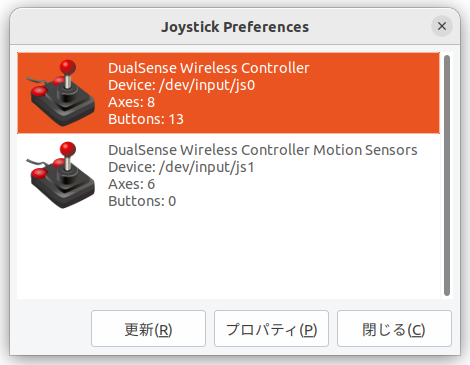

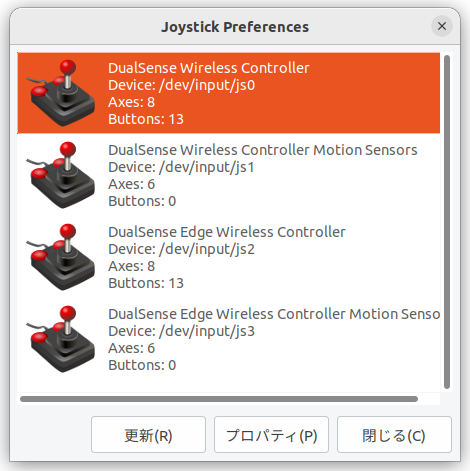

コントローラ内でJoystickクラスを利用するとき、補正された軸及びボタンのID値は以下の列挙体で簡単に指定できます。

.. list-table:: **列挙体と補正された軸のID値の対応**
 :widths: 50,30,30
 :header-rows: 1

 * - 列挙体
   - 対応する軸
   - ID値
 * - Joystick::L_STICK_H_AXIS
   - 左スティック（左右）
   - 0
 * - Joystick::L_STICK_V_AXIS
   - 左スティック（上下）
   - 1
 * - Joystick::R_STICK_H_AXIS
   - 右スティック（左右）
   - 2
 * - Joystick::R_STICK_V_AXIS
   - 右スティック（上下）
   - 3
 * - Joystick::DIRECTIONAL_PAD_H_AXIS
   - 十字ボタン（左右）
   - 4
 * - Joystick::DIRECTIONAL_PAD_V_AXIS
   - 十字ボタン（上下）
   - 5
 * - Joystick::L_TRIGGER_AXIS
   - 左トリガー
   - 6
 * - Joystick::R_TRIGGER_AXIS
   - 右トリガー
   - 7
 * - Joystick::NUM_STD_AXES
   - 全軸数
   - 8

.. list-table:: **列挙体と補正されたボタンのID値の対応**
 :widths: 50,30,30
 :header-rows: 1

 * - 列挙体
   - 対応するボタン（PS系）
   - ID値
 * - Joystick::A_BUTTON
   - A（Cross）ボタン
   - 0
 * - Joystick::B_BUTTON
   - B（Circle）ボタン
   - 1
 * - Joystick::X_BUTTON
   - X（Square）ボタン
   - 2
 * - Joystick::Y_BUTTON
   - Yボタン（Triangle）ボタン
   - 3
 * - Joystick::L_BUTTON
   - L（L1）ボタン
   - 4
 * - Joystick::R_BUTTON
   - R（R1）ボタン
   - 5
 * - Joystick::SELECT_BUTTON
   - SELECT（SHARE）ボタン
   - 6
 * - Joystick::START_BUTTON
   - START（OPTIONS）ボタン
   - 7
 * - Joystick::L_STICK_BUTTON
   - 左スティックボタン　※押込み
   - 8
 * - Joystick::R_STICK_BUTTON
   - 右スティックボタン　※押込み
   - 9
 * - Joystick::LOGO_BUTTON
   - ロゴ（PS）ボタン
   - 10
 * - Joystick::NUM_STD_BUTTONS
   - 全ボタン数
   - 11

仮想ジョイスティックビュー
--------------------------

ゲームパッドがない場合は、「仮想ジョイスティックビュー」を使います。これはメインメニューの「表示」-「ビューの表示」から「仮想ジョイスティック」を選択すると表示されます。

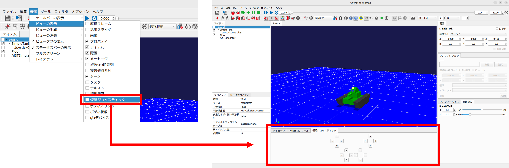

仮想ジョイスティックビューの外観は以下の図のようになっています。

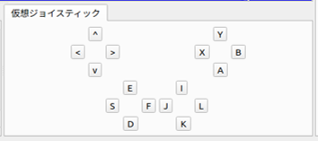

これは通常メインウィンドウ下部のメッセージビューと同じ領域に表示されます。このままではメッセージが見えなくなってしまいますので、メッセージビューと仮想ジョイスティックビューを同時に使えるように :ref:`basics_modify_view_layout` を行っておくとよいでしょう。例えば以下の図のようなレイアウトにします。

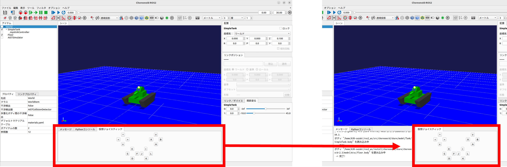

ゲームパッドの実機が接続されているとそちらの入力が優先されますので、仮想ジョイスティックビューを使う場合はゲームパッドは接続しないようにして下さい。

仮想ジョイスティックビューを使う場合は、キーボードで操作します。ビューに表示されているボタンは、それぞれゲームパッドの十字キーやアナログスティックの各軸や、各ボタンに対応しています。この対応関係を下図に示します。

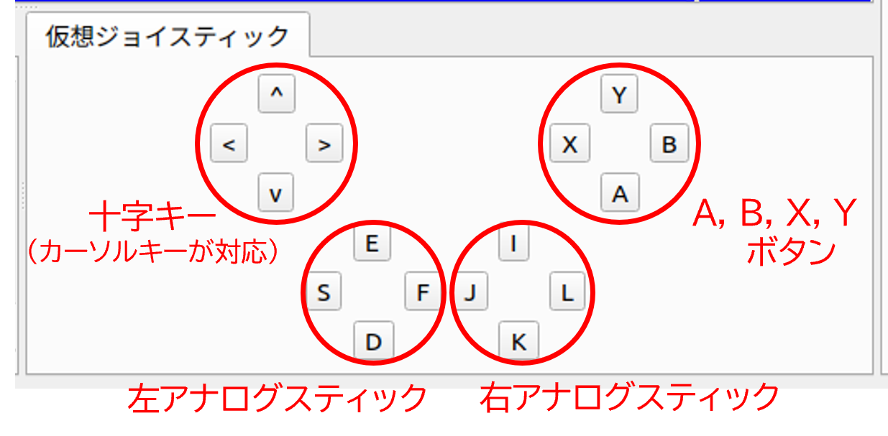

注意点として、 仮想ジョイスティックビューは **キーボードフォーカスが入っていないと機能しません。** このため、使用の際にはいったんこのビューをマウスでクリックするなどして、フォーカスを入れておく必要があります。操作している最中にシーンビューの視点を変えるなどの操作をした場合、フォーカスはそちらに行ってしまっているので、再度仮想ジョイスティックビューをクリックしてフォーカスを入れなおす必要があります。
