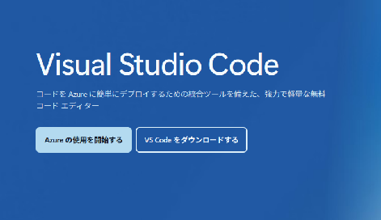
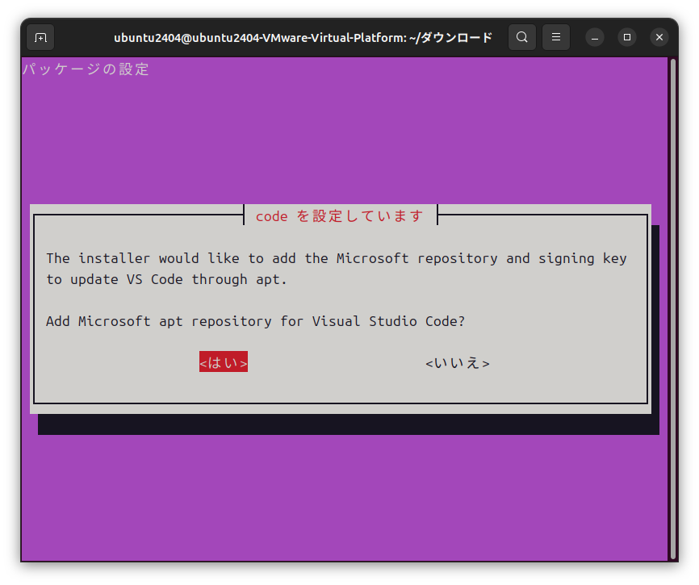
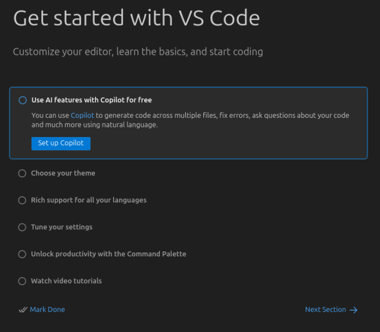
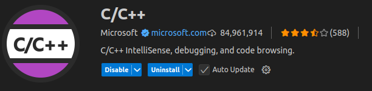
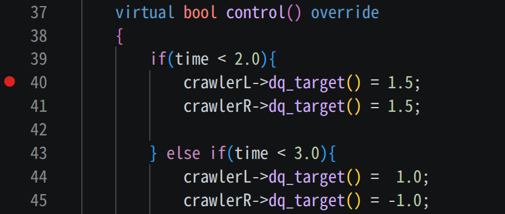
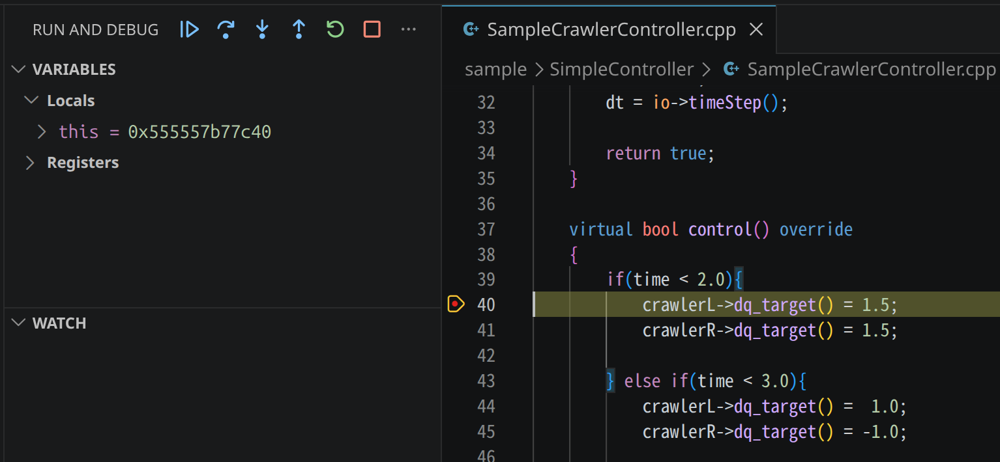
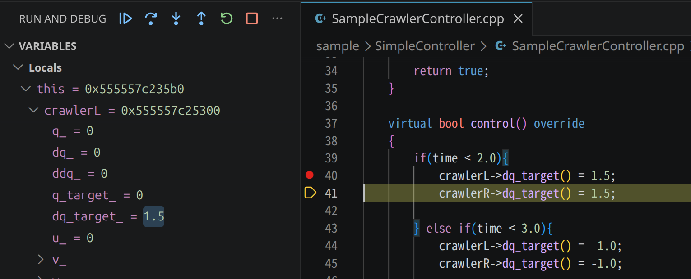

Visual Studio Codeを用いてChoreonoidをデバッグする方法
======================================================

Visual Studio Codeを用いてChoreonoidのプログラムをデバッグする方法を解説します。

本ドキュメントでは、GNU Debugger (GDB) と Microsoft の C/C++ 拡張機能を組み合わせたデバッグ方法を説明します。Linux 上で gcc でビルドした Choreonoid をデバッグする場合、この組み合わせが最も安定しており、機能も豊富です。

.. contents::
   :local:
   :depth: 1

Visual Studio Code と拡張機能のインストール
-------------------------------------------

まず Visual Studio Code 本体をインストールし、続けて C/C++ 拡張機能をインストールします。これらは一度行えば以降のデバッグ作業で繰り返す必要はありません。

Visual Studio Code のインストール
~~~~~~~~~~~~~~~~~~~~~~~~~~~~~~~~~

既に Visual Studio Code を使用している方は、それを使用して頂いて構いません。

ここでは Ubuntu 24.04 LTS (64bit) 上に Visual Studio Code をインストールする場合を例に説明します。

Visual Studio Code のホームページ https://azure.microsoft.com/ja-jp/products/visual-studio-code を開いて、 **VS Codeをダウンロードする** ボタンを押します。

表示されたダウンロードページの **.deb Debian, Ubuntu** ボタンを押して、.debファイル（例： **code_1.102.0-1752099874_amd64.deb** ）をダウンロードします。

.. image:: images/02_install_vscode.png
   :scale: 80

.debファイルが保存されたディレクトリで端末を開いて、 ::

 sudo dpkg -i code_1.102.0-1752099874_amd64.deb

を実行すると、インストールが開始します（ファイル名はダウンロードしたバージョンに合わせて読み替えてください）。
後はインストーラの指示に従ってください。インストール中に以下の画面が表示されたときは、 <はい>/<いいえ> のいずれかを選択してインストールを続けてください。

C/C++ 拡張機能のインストール
~~~~~~~~~~~~~~~~~~~~~~~~~~~~

Visual Studio Code を起動します。端末を起動して、 ::

 code

を実行すると、Visual Studio Code が起動します。

設定の変更が不要な場合は、 **Mark Done** ボタンを押して、初期設定を完了してください。

続けて、Visual Studio Code に C/C++ 拡張機能をインストールします。ウィンドウ左の **Extensions (Ctrl+Shift+K)** ボタンを押して、EXTENSIONSパネル上部の検索バーで **C/C++** を検索し、Microsoft 提供の拡張機能をインストールしてください。

この拡張機能には、GDB を Visual Studio Code から利用するためのデバッガ（cppdbg）が含まれています。

.. note::
   Visual Studio Code でC/C++のデバッグを行うための拡張機能は他にも多数存在します。代表的なものとしては、LLDB を利用する **CodeLLDB** や、GDB を軽量に扱う **Native Debug** 、 **GDB Debugger - Beyond** などがあり、それぞれに特徴があります。本ドキュメントでは、Linux 上で gcc でビルドした Choreonoid をデバッグするにあたって最も安定して動作する Microsoft の C/C++ 拡張機能を採用しており、他の拡張機能の設定方法や使い方については扱いません。拡張機能ごとに launch.json の記法や使い勝手は異なりますので、他の選択肢を利用する際は各拡張機能のドキュメントを参照してください。

以上で、Visual Studio Code と拡張機能のインストールは完了です。

Choreonoid のデバッグビルドを用意する
-------------------------------------

デバッグを行うには、デバッグ情報を含めてビルドされた Choreonoid の実行ファイルが必要です。

デバッグビルドは、通常のリリースビルドとは別のビルドディレクトリで行うことをおすすめします。同一のディレクトリをリリースビルドとデバッグビルドで使い回すと、設定を切り替えるたびに全てのソースを再ビルドすることになり、効率が悪くなります。ディレクトリを分けておけば、デバッグと通常の使用を切り替えながら作業でき、必要になったときにすぐデバッグを開始できます。

本ドキュメントでは、Choreonoid のトップディレクトリ直下に **build-debug** というディレクトリを作成し、そこでデバッグビルドを行う例で説明します。以降の設定やコマンドの例もすべてこのディレクトリ名を前提とします。別の名前を使う場合は、適宜読み替えてください。

Choreonoid をソースコードからビルドする手順の全般については :doc:`../../install/build-ubuntu` を参照してください。ここではデバッグビルド特有の手順のみを示します。

まず、Choreonoid のトップディレクトリ内に build-debug ディレクトリを作成します。 ::

 mkdir build-debug
 cd build-debug

次に、このディレクトリで CMake を実行してビルド設定を行います。デバッグビルドにするためには **CMAKE_BUILD_TYPE** を **Debug** に設定する必要があります。コマンドラインで指定する場合は、 ::

 cmake -DCMAKE_BUILD_TYPE=Debug ..

のように **-DCMAKE_BUILD_TYPE=Debug** オプションを付けて cmake を実行します。

あるいは ccmake を使って対話的に設定することもできます。 ::

 ccmake ..

を実行し、 **CMAKE_BUILD_TYPE** の値を **Debug** に変更し、**configure** , **generate** して終了します。

CMake の設定が完了したら、build-debug ディレクトリ内で ::

 cmake --build .

を実行して Choreonoid をビルドします。並列ビルドを行う場合は ::

 cmake --build . --parallel 並列数

のように **--parallel** オプションで並列数を指定できます。ビルドの詳細や他のビルド方法については :ref:`install_build-ubuntu_build` を参照してください。

以上で、デバッグビルドの準備は完了です。

デバッグ対象のサンプル
----------------------

ここでは、Choreonoid に付属するサンプル ``sample/SimpleController/SampleCrawler.cnoid`` をデバッグ対象として説明します。このプロジェクトは ``SampleCrawlerController`` クラスによって制御されており、そのソースコードは ``sample/SimpleController/SampleCrawlerController.cpp`` にあります。以降ではこのコントローラのコードにブレークポイントを設定し、変数の値を確認しながらプログラムの動作を追っていきます。

launch.json の作成
------------------

Visual Studio Code でデバッグを行うには、デバッグ対象の実行ファイルや起動時の引数などを記述した **launch.json** というファイルを作成する必要があります。

まず Visual Studio Code で Choreonoid を開きます。 **Open Folder...** を押して、Choreonoidのトップディレクトリを指定します。質問が表示された場合は、適宜回答してください。ここでは、 **Trust the authors of all files in the parent folder '<username>'** にチェックを入れて、 **Yes, I trust the authors** と回答しておきます。

次に launch.json を作成します。ウィンドウ左の **Run and Debug (Ctrl+Shift+D)** ボタンを押して、RUN AND DEBUG: RUNパネル内の **create a launch json file** を押します。

.. image:: images/07_run_and_debug.png
   :scale: 50

ウィンドウ上に表示された **Select debugger** のメニューから **C/C++: (gdb) Launch** を選択すると、launch.json ファイルが作成されます。

.. image:: images/09_open_json.png
   :scale: 50

作成された launch.json ファイルは Choreonoid のトップディレクトリ内に以下のように保存されます。 ::

 - choreonoid
   +- .vscode
     +- launch.json

続けて、launch.json ファイルを以下のように編集します。 ::

 {
     "version": "0.2.0",
     "configurations": [
         {
             "name": "(gdb) Launch",
             "type": "cppdbg",
             "request": "launch",
             "program": "${workspaceFolder}/build-debug/bin/choreonoid",
             "args": [ "${workspaceFolder}/sample/SimpleController/SampleCrawler.cnoid" ],
             "cwd": "${workspaceFolder}",
             "MIMode": "gdb"
         }
     ]
 }

ここで、 **program** にはデバッグ対象とする Choreonoid の実行ファイルまでのパスを記述します。また、 **args** は Choreonoid を起動するときに与える引数を記述します。上の例では、先ほど説明したサンプルプロジェクトを起動時に読み込むように指定しています。

.. note::
   Visual Studio Code が自動生成する初期設定には、 ``setupCommands`` として ``-enable-pretty-printing`` が含まれることがあります。この設定を有効にすると ``std::vector`` や ``std::string`` などのSTLコンテナが見やすく表示される利点がありますが、Choreonoid のようにプラグインを多数読み込むアプリケーションでは起動時間が大幅に長くなり、また基底クラスの内容が変数パネルで展開できなくなるという副作用があります。このため、上記の設定例ではこれを含めていません。STLコンテナの内容については、後述する Watch 式を利用して確認することを推奨します。

以上で、launch.json の設定は完了です。

デバッグの実行
--------------

実際にサンプルをデバッグしてみましょう。ここでは、

 * ブレークポイントの設定
 * デバッグの開始
 * 変数の表示
 * ステップ実行

について説明します。

ブレークポイントの設定
~~~~~~~~~~~~~~~~~~~~~~

デバッグを行うファイルを開き、ブレークポイントとする行番号左のところをクリックします。ブレークポイントが設定されると赤い●が付きます。ここでは、 ``sample/SimpleController/SampleCrawlerController.cpp`` の 40 行目にブレークポイントを設定しています。

デバッグの開始
~~~~~~~~~~~~~~

Debug モードで Choreonoid を起動します。

ウィンドウ左の **Run and Debug (Ctrl+Shift+D)** ボタンを押して、RUN AND DEBUG パネル上部の▶ボタンを押すと、launch.json の設定に従って Choreonoid が起動します。Debug モードで Choreonoid を起動している間、Visual Studio Code のウィンドウ上部には、以下のようなデバッグ用のボタン群が表示されます。

.. image:: images/11_button_group.png
   :scale: 50

ボタンは左から順に **Continue (F5)** 、 **Step Over (F10)** 、 **Step Into (F11)** 、 **Step Out (Shift+F11)** 、 **Restart (Ctrl+Shift+F5)** 、 **Stop (Shift+F5)** です。

Choreonoid が起動できたら、通常どおりシミュレーションバーからシミュレーションを実行します。

シミュレーションを実行すると、ブレークポイント（40 行目）でプログラムが一時停止します。

変数の表示
~~~~~~~~~~

プログラムがブレークポイントで停止すると、以下のような画面となり、Visual Studio Code の左側に **VARIABLES** パネルが表示されます。

VARIABLES パネルには、ブレークポイントで停止した時点でアクセス可能な変数（ローカル変数や ``this`` ポインタのメンバなど）が一覧表示され、オブジェクトは展開して中身を確認できます。基底クラスを持つオブジェクトの場合、基底クラスもノードとして表示され、そのメンバを展開することもできます。

一方で、特定の式の値を継続的に監視したい場合は、 **WATCH** パネルに式を登録します。WATCH パネルの **+** ボタンを押して式を入力すると、プログラムが停止するたびにその式が評価され、値が表示されます。例えば、40 行目における ``crawlerL->dq_target()`` の値を確認すると、以下のように 0 であることが確認できます。

.. image:: images/13_show_var.png
   :scale: 50

ステップ実行
~~~~~~~~~~~~

ブレークポイントで停止した状態から、プログラムを一行ずつ実行してみましょう。

Visual Studio Code のウィンドウ上部にあるデバッグ用のボタン群から **Step Over (F10)** を押すと、40 行目が実行された後、次の行で再度停止します。

ここで、 ``crawlerL->dq_target()`` の値を再度確認してみると、その値が 1.5 となっており、40 行目の処理によって値が更新されたことがわかります。

変数表示のヒント
----------------

Visual Studio Code の VARIABLES パネルは、オブジェクトや基底クラスのメンバを自動的に展開できますが、以下のようなケースでは工夫が必要です。

STLコンテナの内容を表示する
~~~~~~~~~~~~~~~~~~~~~~~~~~~

``-enable-pretty-printing`` を有効にしていない場合、``std::string`` や ``std::vector`` などのSTLコンテナは内部構造のまま表示され、中身が直感的には読めません。これらは WATCH パネルに以下のような式を登録することで内容を確認できます。

``std::string`` の文字列内容を表示する例 ::

 str.c_str()

``std::vector`` の全要素を表示する例（gdbの配列表示記法を利用） ::

 vec._M_impl._M_start@vec.size()

``std::shared_ptr`` や ``std::unique_ptr`` の指す先を表示する例 ::

 ptr.get()

これらの式は WATCH パネルに登録しておけば、プログラムが停止するたびに自動的に評価されます。

Pimpl イディオムで実装されたクラスのメンバ
~~~~~~~~~~~~~~~~~~~~~~~~~~~~~~~~~~~~~~~~~

Choreonoid のいくつかのクラスは、実装の詳細を隠蔽するために Pimpl イディオムを採用しており、メンバ変数を ``Impl`` クラスに分離しています。 ``Impl`` クラスはヘッダファイルでは前方宣言のみ行われ、実装は ``.cpp`` ファイル内で定義されているため、他の翻訳単位からは ``Impl`` の型情報が見えず、変数パネルでは ``impl`` ポインタを展開しても中身を確認できません。

この制約は、デバッグ情報の形式（Linux では DWARF が翻訳単位ごとに分かれている）に起因するもので、デバッガを変えても解消しません。対処方法としては、以下のいずれかがあります。

 * 該当クラスの ``.cpp`` ファイル内にブレークポイントを置き、そこで停止させて変数を確認する
 * クラスがアクセサ関数を提供している場合、 WATCH パネルにその関数呼び出しを登録する（例： ``item->name()`` ）

オブジェクトのアクセサ関数を呼び出す
~~~~~~~~~~~~~~~~~~~~~~~~~~~~~~~~~~~

WATCH パネルや DEBUG CONSOLE では、デバッグ対象のプロセス内で関数を呼び出して結果を表示することができます。これを利用して、オブジェクトの状態をアクセサ関数経由で確認することができます。 ::

 item->name()
 item->filePath()
 body->link(0)->p()

ただし、呼び出す関数に副作用がある場合（メンバを変更する、ロックを取る、例外を投げるなど）は、デバッグ対象のプロセス状態に影響を与える可能性があるため注意が必要です。基本的には状態を変更しない const な関数のみを呼び出すのが安全です。
