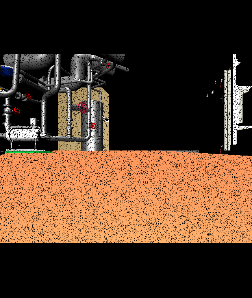

カメラエフェクトのシミュレーション
==================================

.. contents:: 目次
   :local:

.. highlight:: cpp

カメラエフェクト
----------------

Choreonoidでは、Cameraが取得した２次元画像データに以下のカメラエフェクト（視覚的な効果）を付与することができます。

* 白色ノイズ
* 黒色ノイズ
* ＨＳＶ（色相、彩度、明度）
* ＲＧＢ（赤、緑、青）
* ガウシアンノイズ
* 樽型歪み
* ブロックノイズ

これらのカメラエフェクトは、ロボットを遠隔操作しているときにオペレータに提示される不鮮明な２次元画像データを模擬したものです。以下では、Choreonoidでこれらのカメラエフェクトのシミュレーションを行う方法について解説します。

カメラエフェクトの設定項目
--------------------------

Cameraデバイスの画像データにカメラエフェクトを付与するには、
Cameraノードに以下のキーを追加します。

.. list-table:: Cameraノードの追加キー
 :widths: 30,100
 :header-rows: 1
 :align: left

 * - キー
   - 内容
 * - apply_camera_effect
   - true

 * - salt_amount
   - 画像中の白色ノイズの総量(0.0~1.0)。salt_chanceと併せて指定する。
 * - salt_chance
   - 白色ノイズの発生確率(0.0~1.0)。salt_amountと併せて指定する。
 * - pepper_amount
   - 画像中の黒色ノイズの総量(0.0~1.0)。pepper_chanceと併せて指定する。
 * - pepper_chance
   - 黒色ノイズの発生確率(0.0~1.0)。pepper_amountと併せて指定する。
 * - hsv
   - 色相(0.0~1.0)、彩度(0.0~1.0)、明度(0.0~1.0)。
 * - rgb
   - Rの増分(0.0~1.0)、Gの増分(0.0~1.0)、Bの増分(0.0~1.0)。
 * - std_dev
   - ガウシアンノイズの標準偏差(0.0~1.0)。
 * - coef_b
   - 樽型歪みの係数(-1.0~0.0)。
 * - coef_d
   - 画像の拡大率(1.0~32.0)。
 * - mosaic_chance
   - ブロックノイズの発生確率(0.0~1.0)。kernelと併せて指定する。
 * - kernel
   - ブロックのサイズ(8~64)。mosaic_chanceと併せて指定する。

カメラエフェクトの利用
----------------------

カメラエフェクトは、Cameraノードに上記のキーを設定することでカメラ毎に個別に付与されます。

また、Cameraノードに設定したキーの値はコントローラやサブシミュレータからCameraノードにアクセスすることでシミュレーションの実行中にも動的に変更することができます。

以下では、カメラエフェクトを動的に変更する例として、ボディモデルが有するカメラにコントローラからアクセスし、黒色ノイズの発生確率を動的に変更するというサンプルを紹介します。

ボディモデルの用意
~~~~~~~~~~~~~~~~~~

まず、対象とするボディモデルとして、Cameraデバイスを有するものを用意します。そのようなモデルの例として、以下では箱カメラモデルを用いることにします。

箱カメラモデルは、sample/CameraEffect以下に格納されているそのモデルファイル "box.body" において視覚センサが以下のように定義されています。

.. code-block:: yaml

      - &camera
        type: Camera
        name: Nofilter
        translation: [ 0.06, 0, 0 ]
        rotation: [ [ 1, 0, 0, 90 ], [ 0, 1, 0, -90 ] ]
        format: COLOR
        fieldOfView: 62
        nearClipDistance: 0.02
        width: 640
        height: 480
        frameRate: 30
        apply_camera_effect: true
        elements:
          -
            type: Shape
            rotation: [ 1, 0, 0, 90 ]
            geometry: { type: Cylinder, radius: 0.03, height: 0.02 }
            appearance: { material: { diffuseColor: [ 0.2, 0.2, 0.8 ], transparency: 0.5 } }
      - { <<: *camera, name: Salt, salt_amount: 0.3, salt_chance: 1.0 }
      - { <<: *camera, name: Pepper, pepper_amount: 0.3, pepper_chance: 1.0 }
      - { <<: *camera, name: HSV, hsv: [ 0.3, 0.0, 0.0 ] }
      - { <<: *camera, name: RGB, rgb: [ 0.3, 0.0, 0.0 ] }
      - { <<: *camera, name: Barrel, coef_b: -1.0, coef_d: 1.5 }
      - { <<: *camera, name: Mosaic, mosaic_chance: 0.5, kernel: 16 }

ここではYAMLのアンカーとエイリアスによりカメラが複数個設定されています。このうち黒色ノイズを付与するカメラは「Pepper」として定義されており、画像中の黒色ノイズの総量が0.3（=30%）、黒色ノイズの発生確率が1.0（=100%）に設定されています。

また、YAMLのアンカーとエイリアスを用いない場合は次のようになります。

.. code-block:: yaml

      -
        type: Camera
        name: Pepper
        translation: [ 0.06, 0, 0 ]
        rotation: [ [ 1, 0, 0, 90 ], [ 0, 1, 0, -90 ] ]
        format: COLOR
        fieldOfView: 62
        nearClipDistance: 0.02
        width: 640
        height: 480
        frameRate: 30
        apply_camera_effect: true
        pepper_amount: 0.3
        pepper_chance: 1.0
        elements:
          -
            type: Shape
            rotation: [ 1, 0, 0, 90 ]
            geometry: { type: Cylinder, radius: 0.03, height: 0.02 }
            appearance: { material: { diffuseColor: [ 0.2, 0.2, 0.8 ], transparency: 0.5 } }

シミュレーションプロジェクトの作成
~~~~~~~~~~~~~~~~~~~~~~~~~~~~~~~~~~

次に、このモデルを対象としたシミュレーションプロジェクトを作成しましょう。

以下のようにアイテムをそれぞれ配置します。

| + World
|   + Box
|     + SensorVisualizer
|   + Labo1
|   + AISTSimulator
|     + **GLVisionSimulator**

各アイテムの配置が完了したら、アイテムツリービューでSensorVisualizerを展開して、子アイテムの「Pepper」にチェックを入れてください。

次に、アイテムツリービューで「GLVisionSimulator」を選択して、続けてプロパティビューで「ビジョンデータの記録」を「True」に設定します。

サンプルコントローラ
~~~~~~~~~~~~~~~~~~~~

カメラ画像にアクセスするコントローラのサンプルとして、"SampleCameraEffectController" を用いることにします。このコントローラは、ボディモデルが有するCameraデバイス「Pepper」にアクセスし、その画像データに付与される黒色ノイズの発生確率を増減させるというものです。

.. note:: このコントローラのソースは"sample/CameraEffect/SampleCameraEffectController.cpp"になります。このサンプルをビルドするには **BUILD_GL_CAMERA_EFFECT_PLUGIN** をONにします。

プロジェクトにこのコントローラを追加します。 :ref:`simulation-create-controller-item` 、 :ref:`simulation-set-controller-to-controller-item` の例と同様に、「シンプルコントローラ」アイテムを生成して、以下のような配置にします。

| + World
|   + Box
|     + SensorVisualizer
|     + **CameraEffectController**
|   + Labo1
|   + AISTSimulator
|     + GLVisionSimulator

追加したコントローラアイテムの名前をここでは"CameraEffectController"としています。

次に、追加したコントローラアイテムの「コントローラモジュール」プロパティに"SampleCameraEffectController"と記述して、コントローラの本体をセットしてください。

なお、このサンプルプロジェクトは、sample/CameraEffect以下に"CameraEffect.cnoid"として格納されています。

シミュレーションの実行
~~~~~~~~~~~~~~~~~~~~~~

以上の状態でシミュレーションを開始してください。するとPCに接続したゲームパッドのAボタンを押したときに黒色ノイズの発生確率が下がり、Bボタンを押したときに黒色ノイズの発生確率が上がります。

それぞれの例を以下に示します。

.. image:: images/pepper-high.png

これにより、カメラエフェクトのシミュレーションができていて、シミュレーションの実行中にもCameraノードに設定したキーの値をコントローラから動的に変更できていることが分かります。

サンプルコントローラの実装内容
------------------------------

CameraEffectControllerのソースコードを以下に示します。 ::

 #include <cnoid/SimpleController>
 #include <cnoid/Camera>
 #include <cnoid/Joystick>

 using namespace cnoid;

 class SampleCameraEffectController : public SimpleController
 {
     Camera* camera;
     Joystick joystick;

 public:
     virtual bool initialize(SimpleControllerIO* io) override
     {
         camera = io->body()->findDevice<Camera>("Pepper");
         io->enableInput(camera);
         joystick.makeReady();
         return true;
     }

     virtual bool control() override
     {
         joystick.readCurrentState();

         if(camera) {
             bool stateChanged = false;
             double pepper_amount = camera->info()->get("pepper_amount", 0.0);
             if(joystick.getButtonState(Joystick::A_BUTTON)) {
                 camera->info()->write("pepper_amount", std::max(0.0, pepper_amount - 0.001));
                 stateChanged = true;
             } else if(joystick.getButtonState(Joystick::B_BUTTON)) {
                 camera->info()->write("pepper_amount", std::min(1.0, pepper_amount + 0.001));
                 stateChanged = true;
             }
             if(stateChanged) {
                 camera->notifyInfoChange();
             }
         }

         return true;
     }
 };

 CNOID_IMPLEMENT_SIMPLE_CONTROLLER_FACTORY(SampleCameraEffectController)

Cameraデバイスの使用については、 ::

 #include <cnoid/Camera>

によってCameraクラスの定義を取り込み、 ::

 Camera* camera;

に対して ::

 camera = io->body()->findDevice<Camera>("Pepper");

とすることでボディモデルが有するCameraデバイス「Pepper」を取得しています。

このようにして取得したCameraデバイスに関して、initialize関数のforループ内で ::

 io->enableInput(camera);

とすることで、各カメラからの入力を有効化しています。

control関数内では ::

 camera->info()->write("pepper_amount", std::max(0.0, pepper_amount - 0.001));

のようにしてカメラに付与する黒色ノイズの発生確率のキー「pepper_amount」の値を上書きしています。